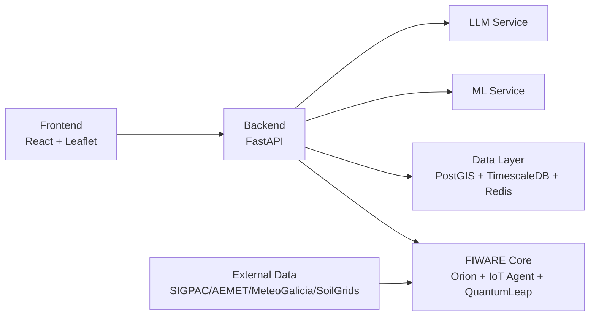

# TerraGalicia DSS

Open-source decision support system for parcel-level agricultural planning in Galicia.


## Overview

TerraGalicia DSS is a FIWARE-oriented platform intended for small farmers, cooperatives, and extension agents to visualize parcels, weather, and agronomic context in one place. The project combines a web map frontend, a FastAPI backend, FIWARE context services (Orion, IoT Agent, QuantumLeap), and an ML/AI layer for suitability and advisory workflows. The repository already contains core infrastructure, synthetic NGSI-LD seed datasets, and real-data ingestion scripts for AEMET, MeteoGalicia, SIGPAC, and SoilGrids. Current implementation is partially functional and includes several placeholders and integration gaps identified in the audit.

## Architecture Diagram



## Prerequisites

- Docker Engine and Docker Compose v1 or v2 (this repo currently uses `docker-compose` in scripts)
- Python 3.11+
- Node.js 20+
- Git
- GitHub CLI (`gh`) optional
- Minimum 8 GB RAM (16 GB recommended if running local LLM services)

## Quick Start

1. Clone repository

	```bash
	git clone https://github.com/AlejandroVarelaV/terragalicia-dss.git
	cd terragalicia-dss
	```

2. Configure environment

	```bash
	cp infra/.env.example infra/.env
	# Edit infra/.env and set required secrets/keys
	```

3. Start stack (from `infra/`)

	```bash
	cd infra
	docker-compose up -d
	```

4. Load seed data

	```bash
	cd ../
	bash scripts/load_seed_data.sh
	```

5. Open services

	- Frontend (Nginx): http://localhost
	- Backend API (expected target): http://localhost/api/v1
	- API docs (expected target): http://localhost/api/v1/docs
	- Grafana: http://localhost:3001
	- Orion Context Broker: http://localhost:1026

## Available URLs When Running

- Frontend: http://localhost
- Backend API: http://localhost/api/v1
- API Docs: http://localhost/api/v1/docs
- Grafana: http://localhost:3001
- Orion CB: http://localhost:1026

## Project Structure

```text
.
├── README.md                                # Project overview and runbook
├── backend/
│   ├── Dockerfile                           # Builds placeholder backend image (main.py only)
│   ├── config.py                            # App settings/environment model
│   ├── main.py                              # Current runtime app entrypoint (placeholder routes)
│   ├── requirements.txt                     # Python deps (currently incomplete for full backend code)
│   ├── api/
│   │   ├── __init__.py
│   │   ├── deps.py                          # Auth, token helpers, dependency providers
│   │   ├── sigpac.py                        # SIGPAC fetch/cache/GeoJSON conversion API
│   │   └── routes/
│   │       ├── __init__.py
│   │       ├── copilot.py                   # Auth + chat endpoints
│   │       ├── crops.py                     # Crop listing/detail
│   │       ├── farms.py                     # Farm CRUD (Orion + seed fallback)
│   │       ├── operations.py                # Parcel operation CRUD (in-memory + Orion best-effort)
│   │       ├── parcels.py                   # Parcel listing/detail/status patch
│   │       ├── simulator.py                 # What-if scenarios
│   │       ├── suitability.py               # Suitability ranking via ML + cache
│   │       └── weather.py                   # Current/forecast/history weather endpoints
│   ├── db/
│   │   ├── postgis.py                       # Async PostGIS client
│   │   └── redis_cache.py                   # Async Redis JSON cache helper
│   ├── models/
│   │   ├── auth.py                          # Auth and token schemas
│   │   ├── crop.py                          # Crop API schemas
│   │   ├── farm.py                          # Farm API schemas
│   │   ├── operation.py                     # Operation API schemas
│   │   ├── parcel.py                        # Parcel/suitability schemas
│   │   └── weather.py                       # Weather response schemas
│   └── services/
│       ├── llm_client.py                    # LLM service client with fallback responses
│       ├── ml_client.py                     # ML service client with deterministic fallback scoring
│       ├── orion.py                         # Orion NGSI-LD client
│       ├── quantumleap.py                   # QuantumLeap history client
│       └── weather_fetcher.py               # MeteoGalicia/OpenWeather/seed weather fetcher
├── data/
│   ├── cache/
│   │   ├── aemet_entities.json              # Cached generated NGSI-LD entities
│   │   ├── meteogalicia_entities.json
│   │   └── soilgrids_entities.json
│   └── seed/
│       ├── README_seed_data.md              # Seed dataset docs and loading notes
│       ├── seed_crops.json
│       ├── seed_farms.json
│       ├── seed_fertilizers.json
│       ├── seed_operations.json
│       ├── seed_parcel_records.json
│       ├── seed_parcels.json
│       ├── seed_soils.json
│       ├── seed_weather_forecast.json
│       └── seed_weather_observed.json
├── docs/
│   ├── APPLICATION.md                       # Product/application PRD-style document
│   ├── PRD.md                               # Product requirements baseline
│   ├── PRD_APPLICATION.md                   # Additional PRD application context
│   ├── architecture.md                      # Target architecture and component plan
│   └── data_model.md                        # NGSI-LD model specification
├── fiware/                                  # Reserved for FIWARE-specific config
├── frontend/
│   ├── Dockerfile                           # Builds placeholder Node server (server.js only)
│   ├── index.html                           # Vite entry HTML
│   ├── package.json                         # React + Vite dependencies/scripts
│   ├── server.js                            # Placeholder static HTML server
│   ├── vite.config.js                       # Vite config + local proxy
│   ├── public/
│   │   └── index.html
│   └── src/
│       ├── App.jsx                          # App shell
│       ├── main.jsx                         # React bootstrap
│       ├── components/
│       │   ├── MapView.jsx                  # Leaflet map + WMS layers + fallback parcels
│       │   └── ParcelPopup.jsx              # Parcel popup HTML template
│       ├── data/
│       │   └── sigpacService.js             # Backend SIGPAC fetch helper
│       └── styles/
│           └── map.css                      # Map/UI styles
├── infra/
│   ├── .env.example                         # Full environment template
│   ├── docker-compose.yml                   # Main multi-service stack definition
│   ├── mosquitto/
│   │   └── mosquitto.conf                   # MQTT broker config
│   └── nginx/
│       ├── nginx.conf                       # Reverse proxy config
│       └── certs/                           # TLS cert placeholder directory
├── ml/
│   ├── Dockerfile                           # Builds placeholder ML service image
│   ├── main.py                              # Placeholder health/predict API
│   └── requirements.txt
└── scripts/
	 ├── check_services.sh                    # Health checks for core services
	 ├── load_seed_data.sh                    # Loads seed entities + creates Orion->QL subscription
	 └── fetch_real_data/
		  ├── __init__.py                      # Shared helpers
		  ├── README.md                         # Fetching scripts usage
		  ├── fetch_aemet.py                   # AEMET -> WeatherForecast mapping
		  ├── fetch_meteogalicia.py            # MeteoGalicia -> WeatherForecast mapping
		  ├── fetch_sigpac.py                  # SIGPAC WFS fetcher
		  ├── fetch_soilgrids.py               # SoilGrids -> AgriSoil mapping
		  ├── load_to_orion.py                 # NGSI-LD upsert utility
		  └── run_all.sh                       # End-to-end fetch+load orchestration
```

## Recent Updates

- Real agronomic ML scorer based on FAO/CSIC crop data.
- Open-Meteo weather integration (no API key required).
- Catastro/SIGPAC WFS integration for real parcel data.
- AgroCopilot / Axente Agronómico chat assistant.
- What-If crop simulator for scenario analysis.
- FIWARE NGSI-LD local context stack (Orion + supporting services).

## Known Issues

Current known runtime limitations:

1. SIGPAC/Catastro live WFS endpoints can intermittently return temporary errors (for example HTTP 503), so the UI may fall back to seed parcels and show the "Datos de proba" badge.
2. Some FIWARE services (especially IoT Agent and Orion during startup) may need retries or a delayed restart in constrained local environments.
3. The environment/scripts still assume `docker-compose` command availability in several places.

## Contributing

Use short-lived feature branches from `main` with a simple flow:

1. `git checkout -b feature/<scope>-<short-description>`
2. Commit in small logical steps with clear messages
3. Open a PR to `main` and request review
4. Squash-merge after CI/checks pass

## License

AGPL-3.0
