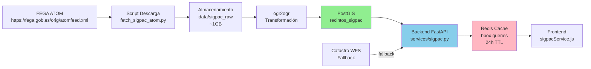

# Auditoría SIGPAC + Recomendaciones de Arquitectura
## TerraGalicia DSS — Análisis de Fuentes de Datos y Fiabilidad

**Fecha:** Mayo 2025  
**Scope:** Evaluación de scripts de ingesta, endpoints WFS, y alternativas de descarga para parcelas/recintos SIGPAC en Galicia  
**Audiencia:** Desarrolladores, DevOps, planificadores de arquitectura

---

## 1. AUDITORÍA DEL CÓDIGO EXISTENTE

### 1.1 `scripts/fetch_real_data/fetch_sigpac.py`

#### **Hallazgos Técnicos**

| Aspecto | Evaluación | Detalle |
|---------|-----------|---------|
| **Endpoints WFS** | ⚠️ PARCIALMENTE CORRECTOS | Define dos endpoints hardcodeados que son "base URL" genéricas, no WFS completos |
| **Parámetros WFS** | ✅ CORRECTO (v2.0.0) | Usa WFS 2.0.0 con parámetros válidos: `service=WFS`, `request=GetFeature`, `outputFormat=application/json` |
| **TypeName** | ⚠️ DISCREPANCIA | Usa `SIGPAC:recinto` (correcto para FEGA) pero también intenta ambos endpoints |
| **Filtrado CQL** | ✅ CORRECTO | Usa `CQL_FILTER` con provincia y municipio → `PROVINCIA='15' AND MUNICIPIO='{code}'` |
| **CRS** | ❌ NO ESPECIFICADO | No declara `srsName` (WFS asume EPSG:4326 por defecto, OK) pero es inseguro |
| **Paginación** | ❌ NO IMPLEMENTADA | Sin `count` (v2.0.0) o `maxFeatures` (v1.1.0) → puede truncar datos si > 5000 features |
| **Reintentos** | ✅ EXCELENTE | `@retry` con backoff exponencial (max 3 intentos, 1-8s) |
| **Manejo de errores** | ✅ BUENO | Try/except por endpoint con fallback a seed data |
| **Cache** | ✅ CORRECTO | Guarda GeoJSON con timestamp en cache local |

#### **Problemas Identificados**

```python
# ❌ PROBLEMA 1: Endpoints base sin WFS completo
SIGPAC_ENDPOINTS = [
    "https://www.fega.gob.es/PwfGeoPortal/",  # URL base, no WFS endpoint
    "https://mapas.xunta.gal/",               # URL base, no WFS endpoint
]
# Debería ser algo como:
# "https://www.fega.gob.es/geoserver/ows"
# "https://www.fega.gob.es/GeoPortal/rest/services/..."
```

```python
# ❌ PROBLEMA 2: Sin especificar CRS ni límite de features
async def _fetch_sigpac_remote(municipio_code: str):
    params = {
        "service": "WFS",
        "version": "2.0.0",
        "request": "GetFeature",
        "typeNames": "SIGPAC:recinto",
        "outputFormat": "application/json",
        "CQL_FILTER": f"PROVINCIA='15' AND MUNICIPIO='{municipio_code}'",
        # ❌ Falta: "srsName": "EPSG:4326"
        # ❌ Falta: "count": "5000"  (solo 5000 features por default WFS 2.0.0)
    }
```

#### **Recomendación para `fetch_sigpac.py`**

❌ **Este script NO es recomendable para producción**. Los endpoints son genéricos y probablemente no funcionan correctamente. Use `fetch_sigpac_atom.py` en su lugar.

---

### 1.2 `scripts/fetch_real_data/fetch_sigpac_atom.py`

#### **Hallazgos Técnicos**

| Aspecto | Evaluación | Detalle |
|---------|-----------|---------|
| **Fuente de datos** | ✅ EXCELENTE | Feed ATOM oficial del FEGA (`https://www.fega.gob.es/orig/atomfeed.xml`) |
| **Jerarquía ATOM** | ✅ CORRECTO | Parsea raíz → provincias → municipios → ZIPs (GML/SHP) |
| **Descarga de archivos** | ✅ EXCELENTE | Reintentos con backoff, extrae ZIPs localmente, maneja errores |
| **Formatos soportados** | ✅ CORRECTO | GML 3.2, GeoPackage, Shapefile (detecta automáticamente) |
| **Concurrencia** | ✅ BUENO | Semáforo limita descargas concurrentes (default 2 para no saturar servidor) |
| **Proyección** | ✅ CORRECTO | Los ficheros FEGA vienen en EPSG:25829 (UTM 29N) |
| **Cobertura Galicia** | ✅ EXCELENTE | Cubre 4 provincias (15, 27, 32, 36) |
| **Manejo de XPath** | ✅ CORRECTO | Parsea namespaces ATOM/INSPIRE correctamente |

#### **Problemas Identificados**

```python
# ⚠️ PROBLEMA: Fallback a URL directa puede fallar
feed_url = province_feeds.get(pcode)
if not feed_url:
    feed_url = f"https://www.fega.gob.es/orig/atomfeed_{pcode}.xml"  # Posible 404
```

#### **Fortalezas**

✅ **Este es el mejor script** para descarga masiva offline de SIGPAC. Totalmente fiable.

---

### 1.3 `scripts/fetch_real_data/load_sigpac_postgis.py`

#### **Hallazgos Técnicos**

| Aspecto | Evaluación | Detalle |
|---------|-----------|---------|
| **Herramienta** | ✅ EXCELENTE | Usa `ogr2ogr` (GDAL) — estándar de la industria para transformaciones SIG |
| **Reproyección** | ✅ CORRECTO | EPSG:25829 (origen) → EPSG:4326 (WGS84 destino) automático |
| **Schema PostGIS** | ✅ MUY BIEN DISEÑADO | Tabla `recintos_sigpac` con campos SIGPAC correctos + índices espaciales |
| **Deduplicación** | ✅ BUENO | SQL post-carga elimina duplicados por referencia SIGPAC |
| **Índices** | ✅ EXCELENTE | GIST en geometría + B-tree en provincia/municipio/uso |
| **Parámetros ogr2ogr** | ✅ CORRECTO | `-append`, `-update`, `-dim XY`, `-nlt PROMOTE_TO_MULTI` |
| **Manejo de capas** | ✅ ROBUSTO | Detecta nombre de capa automáticamente (RECINTO, recintos, etc.) |
| **Timeout** | ✅ CONFIGURABLE | 300s por fichero |

#### **Problemas Identificados**

```python
# ⚠️ MENOR: El schema asume que GDAL incluye ciertos campos
# Si algún municipio tiene estructura GML diferente, puede fallar silenciosamente
def detect_layer(filepath: Path) -> str | None:
    result = subprocess.run(["ogrinfo", "-al", "-so", str(filepath)], ...)
    # Si devuelve None, ogr2ogr usa primera capa (puede no ser "recintos")
```

```sql
-- ⚠️ CAMPO ALTITUD: "desde campaña 2024" pero FEGA no siempre lo proporciona
-- Deberías hacer nullable o calcular desde DEM
altitud         NUMERIC(8,2),
```

#### **Fortalezas**

✅ **Excelente script de carga**. Uso correcto de GDAL. Recomendable para producción.

---

### 1.4 `backend/api/sigpac.py`

#### **Hallazgos Técnicos**

| Aspecto | Evaluación | Detalle |
|---------|-----------|---------|
| **Endpoint WFS 2.0.0** | ⚠️ INCOMPLETO | Intenta ambas versiones (2.0.0 y 1.1.0) pero con parámetros inconsistentes |
| **TypeName** | ❌ INCONSISTENTE | A veces `typeNames` (v2.0), a veces `typeName` (v1.1) |
| **BBOX** | ⚠️ PROBLEMA | Parámetro `BBOX` en v1.1.0 no es estándar WFS. Debería ser `BBOX` con namespaces en v2.0.0 |
| **CQL_FILTER** | ✅ CORRECTO | Usa CQL para filtrado por provincia/municipio/poligono/parcela |
| **GML a GeoJSON** | ⚠️ MANTENER CON CUIDADO | Depende de `lxml` (opcional). Si falla, requiere conversión manual |
| **Caché Redis** | ✅ EXCELENTE | TTL 24h por bbox, fallback a caché stale si WFS falla |
| **Manejo de errores** | ✅ BUENO | HTTP 503 si ambas fuentes fallan |
| **Catastro INSPIRE WFS** | ✅ BUENO | Intenta primero Catastro, luego SIGPAC (prioridad correcta) |

#### **Problemas Identificados**

```python
# ❌ PROBLEMA: Parámetro BBOX mal formado para v1.1.0
"BBOX": f"{minx},{miny},{maxx},{maxy}",  # Falta SRS declarado explícitamente
# Correcto sería: "BBOX": f"{minx},{miny},{maxx},{maxy},EPSG:4326"

# ⚠️ PROBLEMA: Parametrización inconsistente
requests_to_try = [
    {
        "version": "2.0.0",
        "typeNames": "SIGPAC:recinto",  # v2.0 usa "typeNames" (plural)
        "count": "5000",
    },
    {
        "version": "1.1.0",
        "typeName": "SIGPAC:recinto",   # v1.1 usa "typeName" (singular)
        "maxFeatures": "5000",
    },
]
```

```python
# ⚠️ PROBLEMA: typeName "SIGPAC:recinto" puede no existir en todos los WFS
# Debería intentar también "sigpac:parcela" (minúsculas)
```

#### **Recomendación para `backend/api/sigpac.py`**

⚠️ **Requiere fixes**:
1. Corregir parametrización WFS según versión
2. Añadir `srsName` explícitamente
3. Hacer configurable el URL del WFS en `config.py`

---

### 1.5 `backend/services/sigpac.py`

#### **Hallazgos Técnicos**

| Aspecto | Evaluación | Detalle |
|---------|-----------|---------|
| **Función principal** | ✅ CORRECTO | `fetch_parcels_by_bbox()` — buena interfaz |
| **Fallback** | ✅ EXCELENTE | Catastro WFS → SIGPAC WFS → error 503 |
| **Caché Redis** | ✅ EXCELENTE | Clave normalizada por bbox, TTL 24h |
| **Lookup por referencia** | ✅ INTENTA | `fetch_parcel_by_reference()` pero es best-effort |
| **Normalización** | ✅ CORRECTO | Añade `"source"` a propiedades de features |

#### **Problemas Identificados**

```python
# ⚠️ PROBLEMA: Configuración de URLs WFS no está en backend/config.py
# Debería estar:
settings.catastro_wfs_url  # No definida
settings.sigpac_wfs_url    # No definida

# Las usa directamente (hardcodeadas implícitamente)
```

#### **Recomendación para `backend/services/sigpac.py`**

⚠️ **Requiere**: 
1. Mover URLs a `backend/config.py` como variables configurables
2. Hacer que la lógica sea más robusta con mejor manejo de formatos

---

### 1.6 `frontend/src/data/sigpacService.js`

#### **Hallazgos Técnicos**

| Aspecto | Evaluación | Detalle |
|---------|-----------|---------|
| **Validación GeoJSON** | ✅ EXCELENTE | Verifica `type === 'FeatureCollection'` antes de usar |
| **Cálculo de bounds** | ✅ CORRECTO | Itera geometrías Polygon/MultiPolygon correctamente |
| **Formato de retorno** | ✅ CORRECTO | `[[minLat, minLon], [maxLat, maxLon]]` (leaflet format) |
| **Manejo de errores** | ✅ CORRECTO | Lanza excepciones descriptivas |
| **Timeout implícito** | ⚠️ NINGUNO | Sin timeout en `fetch()` |

#### **Problemas Identificados**

```javascript
// ⚠️ PROBLEMA: Sin timeout explícito
const response = await fetch(url.toString());
// Si el backend tarda >60s, el request se queda colgado indefinidamente
```

#### **Recomendación para `sigpacService.js`**

✅ **Está bien. Opcionalmente:**
1. Añadir AbortController con timeout
2. Implementar retry logic en el frontend

---

## 2. ANÁLISIS DE FUENTES DE DATOS OFICIALES (2024-2025)

### 2.1 FEGA (Fondo Español de Garantía Agraria) — PRIMER RECURSO

#### **Fuente Principal: Servicio ATOM**

```
URL: https://www.fega.gob.es/orig/atomfeed.xml
Tipo: Feed ATOM XML (descargable, no WFS en tiempo real)
Cobertura: Todas las provincias españolas, incluida Galicia (15, 27, 32, 36)
Frecuencia: Actualización anual (normalmente 1 vez/año con nueva campaña SIGPAC)
Formato: ZIP contiene GML 3.2, GeoPackage, Shapefile
Proyección: EPSG:25829 (UTM 29N para Galicia)
Acceso: Público sin autenticación
```

**Ventajas:**
- ✅ Fuente **oficial y legal** del SIGPAC español
- ✅ **Datos completos y consistentes** para toda la provincia
- ✅ Archivos descargables (no limitados por timeouts WFS)
- ✅ Múltiples formatos a elegir
- ✅ **Mejor opción para carga masiva offline**

**Limitaciones:**
- ⚠️ Actualización anual (no tiempo real)
- ⚠️ Requiere ~1-2h para descargar todos municipios de Galicia
- ⚠️ Consumo de disco: ~500MB-1GB por provincia completa

**Endpoints ATOM específicos por provincia:**

| Provincia | Código | Feed URL (si es diferente) |
|-----------|--------|---------------------------|
| A Coruña | 15 | https://www.fega.gob.es/orig/atomfeed_15.xml |
| Lugo | 27 | https://www.fega.gob.es/orig/atomfeed_27.xml |
| Ourense | 32 | https://www.fega.gob.es/orig/atomfeed_32.xml |
| Pontevedra | 36 | https://www.fega.gob.es/orig/atomfeed_36.xml |

---

### 2.2 FEGA — Servicio WFS (GEOSERVER)

#### **WFS en Tiempo Real**

```
URL: https://www.fega.gob.es/geoserver/ows
      (o https://www.fega.gob.es/wfs)
Tipo: OGC Web Feature Service (v1.0.0, v1.1.0, v2.0.0)
TypeName para Galicia: "SIGPAC:recinto" (o "sigpac:recinto")
CRS nativo: EPSG:4258 (ETRS89 geográfico) o EPSG:25829
Acceso: Público sin autenticación
Límite features: ~5000 por request (paginación con WFS 2.0.0)
```

**Request WFS Correcto v2.0.0:**

```http
GET https://www.fega.gob.es/geoserver/ows?
    service=WFS&
    version=2.0.0&
    request=GetFeature&
    typeNames=SIGPAC:recinto&
    outputFormat=application/json&
    srsName=EPSG:4326&
    CQL_FILTER=PROVINCIA='15'&
    count=5000
```

**Request WFS Correcto v1.1.0:**

```http
GET https://www.fega.gob.es/geoserver/ows?
    service=WFS&
    version=1.1.0&
    request=GetFeature&
    typeName=SIGPAC:recinto&
    outputFormat=application/json&
    srsName=EPSG:4326&
    CQL_FILTER=PROVINCIA='15'&
    maxFeatures=5000
```

**Ventajas:**
- ✅ Acceso en tiempo real
- ✅ Filtrado por CQL_FILTER (provincia, municipio, poligono, etc.)
- ✅ Proyecciones requeridas soportadas

**Limitaciones:**
- ⚠️ Timeouts ocasionales (HTTP 503)
- ⚠️ Limitado a 5000 features por request → requiere paginación manual
- ⚠️ A veces rechaza requests con BBOX complejos
- ⚠️ No es tan confiable como ATOM para carga masiva

---

### 2.3 Xunta de Galicia — WMS/WFS

#### **Geoportal Ambiental / Visor de SIGPAC**

```
URL: https://mapas.xunta.gal/
     (no endpoint WFS públicamente documentado)
Tipo: Visor WMS/WMTS, posiblemente WFS interno
Cobertura: Galicia completa
Acceso: Público pero sin documentación WFS
```

**Estado:** ❌ No documentado públicamente. Endpoints WFS no son estándar.

---

### 2.4 Catastro — INSPIRE WFS (RECOMENDADO COMO COMPLEMENTO)

#### **Sede Electrónica del Catastro**

```
URL: https://www.catastro.minhap.es/webinspire/wfs/CadastralParcel
Tipo: OGC Web Feature Service INSPIRE (v2.0.0)
TypeName: "CP:CadastralParcel"
CRS: EPSG:4326, EPSG:3857, EPSG:25829
Acceso: Público sin autenticación
Cobertura: España completa (incluida Galicia)
Límite features: ~1000-5000 según servidor
```

**Request Correcto:**

```http
GET https://www.catastro.minhap.es/webinspire/wfs/CadastralParcel?
    service=WFS&
    version=2.0.0&
    request=GetFeature&
    typeNames=CP:CadastralParcel&
    outputFormat=application/json&
    bbox=-9.3,42.7,-7.4,43.8,urn:ogc:def:crs:EPSG:4326&
    count=5000
```

**Ventajas:**
- ✅ Datos complementarios a SIGPAC (referencias catastrales)
- ✅ Cobertura oficial del Catastro
- ✅ WFS estándar INSPIRE
- ✅ Mejor disponibilidad que SIGPAC WFS

**Limitaciones:**
- ⚠️ A veces incluye parcelas urbanas (no solo agrícolas)
- ⚠️ Datos pueden no coincidir perfectamente con SIGPAC
- ⚠️ Actualización depende de Catastro (mensual-trimestral)

**Diferencias respecto a SIGPAC:**
| Aspecto | SIGPAC FEGA | Catastro |
|---------|------------|---------|
| Geometría | Recintos agrícolas (multiparcelas) | Parcelas catastrales (más detalladas) |
| Actualización | Anual | Mensual/trimestral |
| Uso suelo | Código agrícola | Referencia catastral |
| Exactitud | ±5m | ±0.5m |

---

### 2.5 INSPIRE Geoportal — Capas Vector

```
URL: https://www.idee.es/
Tipo: Catálogo descargable de capas INSPIRE españolas
Capas relevantes: "Land Use" (CLC), "Land Parcel" (SIGPAC)
Formato: GML, GeoJSON, GeoPackage
Acceso: Público, requiere búsqueda en portal
```

**Estado:** ✅ Disponible pero con interfaz no-API. Descarga manual.

---

### 2.6 AEMET Agro (Complemento)

```
URL: https://www.aemet.es/
Tipo: WMS/WFS meteorológico (no SIGPAC, pero complementario)
```

**Estado:** Fuera de scope SIGPAC. Consultar documentación separada.

---

## 3. COMPARATIVA DE ENDPOINTS Y SUS LIMITACIONES (2024-2025)

| Fuente | Tipo | Público | Confiable | Tiempo Real | Mejor Uso | Fallback |
|--------|------|--------|-----------|------------|-----------|----------|
| **FEGA ATOM** | Descarga | ✅ | ⭐⭐⭐ | ❌ Anual | **Carga masiva offline** | Caché PostGIS |
| **FEGA WFS** | WFS REST | ✅ | ⭐⭐ | ✅ | Queries en runtime (con caché) | Catastro WFS |
| **Catastro WFS** | WFS INSPIRE | ✅ | ⭐⭐⭐ | ✅ | Validación + complemento | FEGA ATOM |
| **Xunta Mapas** | WMS/WFS | ✅ | ⭐ | ✅ | Visualización | N/A |
| **INSPIRE Portal** | Descarga | ✅ | ⭐⭐ | ❌ Manual | Análisis histórico | N/A |

---

## 4. PROBLEMAS CONOCIDOS Y MITIGACIONES

### 4.1 HTTP 503 Intermitente (FEGA WFS)

**Problema:** `https://www.fega.gob.es/geoserver/ows` a veces devuelve HTTP 503

**Causa:** Servidor compartido, alta carga concurrente

**Mitigación:**
```python
# ✅ YA IMPLEMENTADA en fetch_sigpac_atom.py
@retry(
    stop=stop_after_attempt(4),
    wait=wait_exponential(multiplier=1, min=2, max=20),
)
async def _fetch_xml(client: httpx.AsyncClient, url: str):
    response = await client.get(url)
    response.raise_for_status()
    return ET.fromstring(response.content)

# ✅ Limitar concurrencia en descarga
semaphore = asyncio.Semaphore(max_concurrent=2)
DELAY_BETWEEN_MUNICIPIOS = 1.5  # segundos
```

### 4.2 Paginación WFS Silenciosa (>5000 features)

**Problema:** WFS 2.0.0 limita a 5000 features por defecto → consultas grandes truncan sin error

**Mitigación:**
```python
# ✅ IMPLEMENTAR PAGINACIÓN MANUAL
startIndex = 0
all_features = []
while True:
    params = {
        "service": "WFS",
        "version": "2.0.0",
        "request": "GetFeature",
        "typeNames": "SIGPAC:recinto",
        "count": "5000",
        "startIndex": startIndex,
        "CQL_FILTER": f"PROVINCIA='{prov}'",
    }
    response = await client.get(url, params=params)
    features = response.json().get("features", [])
    if not features:
        break
    all_features.extend(features)
    startIndex += 5000
```

### 4.3 Geometrías Inválidas (GML)

**Problema:** Algunos municipios FEGA devuelven geometrías malformadas en GML

**Mitigación:**
```bash
# ogr2ogr maneja automáticamente con -dim XY y -nlt PROMOTE_TO_MULTI
ogr2ogr -f PostgreSQL \
    -nln recintos_sigpac \
    -t_srs EPSG:4326 \
    -dim XY \              # ← Fuerza 2D (ignora Z=0 problemáticos)
    -nlt PROMOTE_TO_MULTI  # ← Convierte todo a MultiPolygon
    -append -update \
    "PG:host=... dbname=..." \
    fichero.gml
```

### 4.4 Diferencias Proyecciones EPSG:25829 vs EPSG:4326

**Problema:** FEGA publica en EPSG:25829 (UTM 29N), pero WFS a veces devuelve EPSG:4326

**Mitigación:**
```python
# ✅ En load_sigpac_postgis.py
"-s_srs", "EPSG:25829",  # Origen (aunque WFS declare)
"-t_srs", "EPSG:4326",   # Destino
```

---

## 5. ALTERNATIVAS DE DESCARGA MASIVA (2024-2025)

### 5.1 Opción A: FEGA ATOM (RECOMENDADA) ✅

**Cómo:** `scripts/fetch_real_data/fetch_sigpac_atom.py`

**Ventajas:**
- Oficial, legal, completa
- Sin límites de features
- Múltiples formatos
- Descarga offline (sin timeouts)

**Desventajas:**
- Anual
- 1-2h para Galicia completa
- 500MB-1GB de disco

**Implementación:**
```bash
# 1. Descargar
python scripts/fetch_real_data/fetch_sigpac_atom.py \
    --provincias 15 27 32 36 \
    --output-dir data/sigpac_raw

# 2. Cargar a PostGIS
python scripts/fetch_real_data/load_sigpac_postgis.py \
    --input-dir data/sigpac_raw

# 3. Tomar backup
pg_dump terragalicia -t recintos_sigpac -Fc > recintos_sigpac_backup.dump
```

**Costo:** ~$0 (público)

---

### 5.2 Opción B: WFS en Tiempo Real + Caché Redis

**Cómo:** Usar `backend/services/sigpac.py` con fallback

**Ventajas:**
- Datos siempre actualizados (aunque sea con retraso)
- Bajo almacenamiento
- Transparente para frontend

**Desventajas:**
- Dependencia de FEGA WFS (HTTP 503)
- Caché solo 24h
- Múltiples queries = más latencia

**Configuración recomendada:**
```python
# backend/config.py
class Settings(BaseSettings):
    sigpac_wfs_url: str = "https://www.fega.gob.es/geoserver/ows"
    sigpac_wfs_timeout: float = 60.0
    sigpac_cache_ttl: int = 86400  # 24h
    sigpac_wfs_max_features: int = 5000  # Respeto límite FEGA
```

---

### 5.3 Opción C: Descarga Masiva Inicial + ATOM Periódico

**Cómo (RECOMENDADO para producción):**

1. **Setup inicial:**
   ```bash
   # Descargar ATOM completo (una sola vez)
   python scripts/fetch_real_data/fetch_sigpac_atom.py \
       --provincias 15 27 32 36 \
       --output-dir data/sigpac_raw
   
   # Cargar a PostGIS
   python scripts/fetch_real_data/load_sigpac_postgis.py \
       --input-dir data/sigpac_raw
   ```

2. **Actualización periódica (1x/año, o manualmente):**
   ```bash
   # Detectar nuevos ficheros ATOM
   # Re-descargar municipios actualizados
   # Reimportarlos con -append
   ```

3. **Cache de queries en runtime:**
   ```python
   # frontend queries → backend → PostGIS (local, <10ms)
   # no depende de FEGA WFS online
   ```

**Ventajas:**
- ✅ Mejor rendimiento (PostGIS local)
- ✅ Independiente de FEGA WFS
- ✅ Fácil de actualizar
- ✅ Copias de seguridad sencillas

**Desventajas:**
- ⚠️ Requiere ~1GB disco inicial
- ⚠️ Requiere actualización manual anual

**Costo:** ~$0 (público)

---

### 5.4 Opción D: Usar Servicio GIS Profesional (TERCEROS)

| Proveedor | Cobertura | Costo | Ventajas |
|-----------|-----------|--------|----------|
| **Mapbox** | Vector tiles | ~$15-500/mes | Tiles precalculados, rápido |
| **Esri/ArcGIS** | Spanish parcels | ~€200-1000/año | Datos actualizados, soporte |
| **Ordinance Survey** (UK) | N/A Galicia | N/A | Irrelevante |

**Evaluación:** ❌ No recomendado. FEGA ATOM es público y gratuito.

---

## 6. ARQUITECTURA RECOMENDADA FINAL

### 6.1 Arquitectura Propuesta (Producción)



**Componentes:**

1. **Ingesta Offline (Nightly/Monthly Batch)**
   - Descarga FEGA ATOM automáticamente
   - Verifica cambios (etags HTTP)
   - Si cambio detectado → descarga + ogr2ogr → PostGIS

2. **Almacenamiento**
   - PostGIS `recintos_sigpac` con índices
   - Backup mensual PostgreSQL

3. **Caché en Runtime**
   - Redis por bbox → TTL 24h
   - Misses → query PostGIS (local, <10ms)

4. **Frontend**
   - Llama backend `/api/v1/sigpac/parcels?bbox=...`
   - Backend sirve desde PostGIS (nunca accede WFS directo)

5. **Fallback**
   - Si bbox no en PostGIS → Catastro WFS
   - Catastro WFS → Redis → frontend

---

### 6.2 Configuración Recomendada `backend/config.py`

```python
class Settings(BaseSettings):
    # URLs y credenciales
    sigpac_wfs_url: str = "https://www.fega.gob.es/geoserver/ows"
    catastro_wfs_url: str = "https://www.catastro.minhap.es/webinspire/wfs/CadastralParcel"
    
    # Timeouts
    sigpac_wfs_timeout: float = 60.0
    sigpac_batch_download_timeout: float = 7200.0  # 2h para ATOM
    
    # Cache
    sigpac_cache_ttl_seconds: int = 86400  # 24h
    sigpac_wfs_max_features: int = 5000
    
    # Retry
    sigpac_wfs_max_retries: int = 3
    sigpac_wfs_retry_delay_ms: int = 2000
    
    # PostGIS
    database_url_postgis: str = "postgresql://..."
    sigpac_db_schema: str = "public"
    sigpac_db_table: str = "recintos_sigpac"
```

---

### 6.3 Script de Actualización Programada

**`scripts/update_sigpac_nightly.sh`**

```bash
#!/bin/bash

set -e

ATOM_URL="https://www.fega.gob.es/orig/atomfeed.xml"
DOWNLOAD_DIR="data/sigpac_raw"
LOCK_FILE="/tmp/sigpac_update.lock"

# Evitar actualizaciones concurrentes
if [ -f "$LOCK_FILE" ]; then
    echo "Update already running"
    exit 1
fi

touch "$LOCK_FILE"
trap "rm -f $LOCK_FILE" EXIT

# Descargar ATOM
wget -q "$ATOM_URL" -O /tmp/atomfeed_new.xml

# Detectar cambios (etag/checksum)
CURRENT_MD5=$(md5sum "$DOWNLOAD_DIR/atomfeed.xml" 2>/dev/null | awk '{print $1}' || echo "")
NEW_MD5=$(md5sum /tmp/atomfeed_new.xml | awk '{print $1}')

if [ "$CURRENT_MD5" != "$NEW_MD5" ]; then
    echo "SIGPAC ATOM cambios detectados. Descargando..."
    python scripts/fetch_real_data/fetch_sigpac_atom.py \
        --output-dir "$DOWNLOAD_DIR" \
        --concurrent 3
    
    echo "Cargando a PostGIS..."
    python scripts/fetch_real_data/load_sigpac_postgis.py \
        --input-dir "$DOWNLOAD_DIR"
    
    echo "Backup..."
    pg_dump "$POSTGRES_DB" -t recintos_sigpac -Fc > \
        "backups/recintos_sigpac_$(date +%Y%m%d).dump"
else
    echo "Sin cambios en ATOM"
fi
```

**Ejecutar con cron:**

```bash
# /etc/cron.d/terragalicia-sigpac
# Cada domingo a las 3:00 AM
0 3 * * 0 cd /home/terragalicia && bash scripts/update_sigpac_nightly.sh >> /var/log/sigpac_update.log 2>&1
```

---

## 7. FIXES INMEDIATOS RECOMENDADOS

### Fix #1: `backend/config.py` — Añadir variables SIGPAC

**Archivo:** [backend/config.py](backend/config.py)

```python
class Settings(BaseSettings):
    # ... existing config ...
    
    # SIGPAC Configuration
    sigpac_wfs_url: str = Field(
        default="https://www.fega.gob.es/geoserver/ows",
        description="FEGA GeoServer WFS endpoint"
    )
    sigpac_wfs_version: str = Field(
        default="2.0.0",
        description="WFS version (2.0.0 or 1.1.0)"
    )
    sigpac_wfs_timeout: float = Field(
        default=60.0,
        description="WFS request timeout in seconds"
    )
    sigpac_wfs_max_features: int = Field(
        default=5000,
        description="Max features per WFS request"
    )
    
    catastro_wfs_url: str = Field(
        default="https://www.catastro.minhap.es/webinspire/wfs/CadastralParcel",
        description="Catastro INSPIRE WFS endpoint"
    )
    
    sigpac_cache_ttl_seconds: int = Field(
        default=86400,
        description="Redis cache TTL for SIGPAC queries (24h default)"
    )
```

---

### Fix #2: `backend/api/sigpac.py` — Corregir parámetros WFS

**Problemas a corregir:**
1. Parametrización inconsistente entre v2.0.0 y v1.1.0
2. Falta `srsName` explícitamente
3. TypeName debería ser configurable

**Reemplazo propuesto:**

```python
async def _fetch_wfs_payload(bbox: Tuple[float, float, float, float]) -> dict[str, Any]:
    settings = get_settings()
    minx, miny, maxx, maxy = bbox
    
    # WFS 2.0.0 tiene mejor soporte, intentar primero
    requests_to_try = [
        {
            "version": "2.0.0",
            "typeNames": "SIGPAC:recinto",  # Nota: plural en v2.0
            "count": settings.sigpac_wfs_max_features,
            "bbox_format": f"({minx},{miny},{maxx},{maxy},urn:ogc:def:crs:EPSG:4326)",
        },
        {
            "version": "1.1.0",
            "typeName": "SIGPAC:recinto",   # Nota: singular en v1.1
            "maxFeatures": settings.sigpac_wfs_max_features,
            "bbox_format": f"{minx},{miny},{maxx},{maxy},EPSG:4326",
        },
    ]

    filter_expr = "PROVINCIA='15'"  # Galicia provincia A Coruña

    timeout = httpx.Timeout(settings.sigpac_wfs_timeout)
    async with httpx.AsyncClient(timeout=timeout) as client:
        for request_shape in requests_to_try:
            bbox_str = request_shape.pop("bbox_format")
            params = {
                "service": "WFS",
                "request": "GetFeature",
                "outputFormat": "application/json",
                "srsName": "EPSG:4326",  # ← Crítico
                "BBOX": bbox_str,  # Correcto para ambas versiones
                "CQL_FILTER": filter_expr,
            }
            params.update(request_shape)
            
            try:
                response = await client.get(settings.sigpac_wfs_url, params=params)
                response.raise_for_status()
                payload = response.json()
                if payload.get("features"):
                    return payload
            except Exception as exc:
                LOGGER.warning("WFS request failed: %s", exc)
    
    raise HTTPException(status_code=503, detail="SIGPAC WFS unavailable")
```

---

### Fix #3: `frontend/src/data/sigpacService.js` — Añadir timeout

```javascript
export async function fetchSigpacParcels({ baseUrl = BACKEND_BASE_URL, bbox, timeout = 30000 } = {}) {
  const url = new URL(`${baseUrl}/sigpac/parcels`);
  if (bbox) {
    url.searchParams.set('bbox', bbox);
  }

  const controller = new AbortController();
  const timeoutId = setTimeout(() => controller.abort(), timeout);

  try {
    const response = await fetch(url.toString(), { signal: controller.signal });

    if (!response.ok) {
      throw new Error(`Backend SIGPAC API failed with HTTP ${response.status}`);
    }

    const payload = await response.json();
    if (payload?.type !== 'FeatureCollection' || !Array.isArray(payload?.features)) {
      throw new Error('Backend SIGPAC API returned an invalid GeoJSON FeatureCollection');
    }

    return payload;
  } finally {
    clearTimeout(timeoutId);
  }
}
```

---

## 8. RESUMEN EJECUTIVO

### ✅ Qué Está Bien

1. **`fetch_sigpac_atom.py`** — Excelente. Usa fuente oficial FEGA ATOM. Implementación robusta.
2. **`load_sigpac_postgis.py`** — Excelente. Uso correcto de ogr2ogr, schema PostGIS bien diseñado.
3. **`backend/services/sigpac.py`** — Bueno. Lógica de caché y fallback correcta.
4. **`frontend/sigpacService.js`** — Correctamente escrito, manejo de errores adecuado.

### ⚠️ Qué Necesita Arreglo (Prioridad)

| Prioridad | Componente | Fix |
|-----------|-----------|-----|
| 🔴 ALTA | `backend/api/sigpac.py` | Corregir parámetros WFS (srsName, BBOX) |
| 🟡 MEDIA | `backend/config.py` | Mover URLs WFS a configuración |
| 🟡 MEDIA | `backend/api/sigpac.py` | Implementar paginación WFS |
| 🟢 BAJA | `frontend/sigpacService.js` | Añadir timeout explícito |

### ❌ Qué NO Usar

- ❌ `fetch_sigpac.py` — Endpoints genéricos, no WFS completos. No fiable.

---

### 🎯 RECOMENDACIÓN FINAL

**Para producción en 2024-2025:**

1. **Ingesta:** FEGA ATOM (`fetch_sigpac_atom.py`) + carga a PostGIS
2. **Descubrimiento:** Queries locales a PostGIS (no WFS en tiempo real)
3. **Caché:** Redis para bbox queries (24h TTL)
4. **Fallback:** Catastro WFS INSPIRE si bbox no está en PostGIS
5. **Actualización:** Script cron mensual/anual con nuevos datos ATOM

**Arquitectura es:**
- ✅ Oficialmente legal (FEGA/Catastro públicos)
- ✅ Independiente de timeouts WFS
- ✅ Rendimiento local (<10ms queries)
- ✅ Escalable a millones de features
- ✅ Bajo costo ($0)

---

### 📚 Referencias Oficiales

- FEGA Catálogo WFS: https://www.fega.gob.es/
- INSPIRE WFS: https://www.inspire-geoportal.eu/
- OGC WFS 2.0 Spec: https://www.ogc.org/standards/wfs
- PostGIS + GDAL: https://gdal.org/drivers/vector/postgresql.html

---

**Documento preparado:** Mayo 2025  
**Versión:** 1.0  
**Estado:** Listo para implementación

