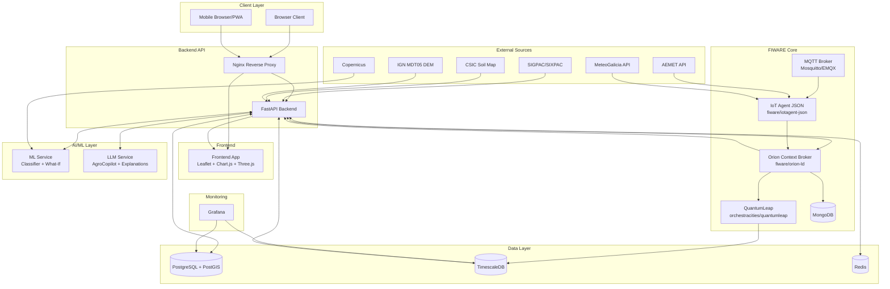

# TerraGalicia DSS Architecture (MVP)

## 1. Architecture Overview
TerraGalicia uses a hybrid **event-driven + REST** architecture aligned with FIWARE reference patterns: synchronous business operations are handled through a FastAPI backend (REST), while telemetry, weather ingestion, and historization rely on event propagation through IoT Agent, Orion Context Broker, and QuantumLeap. The architecture explicitly separates **current context state** (Orion CB, NGSI-LD), **static/geospatial domain data** (PostgreSQL + PostGIS), and **time-series history** (TimescaleDB via QuantumLeap). The AI/ML layer (crop suitability + explanation/chat) is decoupled from FIWARE core so model providers and inference stacks can evolve independently without changing context management contracts.

---

## 2. Component Inventory

| Component | Technology | Role | Port | Notes |
|---|---|---|---|---|
| Frontend Web App | React + Leaflet + Chart.js + Three.js | UI for map, charts, 2.5D terrain panel, parcel operations, AgroCopilot chat | 3000 (dev), 80/443 via Nginx | Served behind Nginx in prod; mobile-responsive PWA target [DECISION NEEDED] |
| Backend API | FastAPI (Python 3.11+) | REST API gateway, auth, orchestration across FIWARE/data/AI services | 8000 | Main BFF layer; handles RBAC and aggregation |
| Orion Context Broker | FIWARE Orion-LD (`fiware/orion-ld`) | NGSI-LD current state storage and query/subscription engine | 1026 | Requires MongoDB backend [DECISION NEEDED: single Mongo or HA replica set] |
| MongoDB (Orion backend) | MongoDB 6/7 | Persistence backend for Orion current context entities | 27017 | Required by Orion; not a business data store |
| IoT Agent JSON | FIWARE IoT Agent JSON (`fiware/iotagent-json`) | Southbound ingestion (HTTP/MQTT), payload mapping to NGSI-LD updates | 4041 (northbound), 7896 (southbound HTTP) | Uses MQTT broker for topic ingestion |
| MQTT Broker | Mosquitto (`eclipse-mosquitto`) or EMQX (`emqx/emqx`) | Telemetry/event messaging from sensors/connectors to IoT Agent | 1883 (MQTT), 9001 (WS optional) | [DECISION NEEDED] Choose broker: Mosquitto (simple) vs EMQX (ops features) |
| QuantumLeap | QuantumLeap (`orchestracities/quantumleap`) | Time-series historization via Orion subscription notifications | 8668 | STH-Comet compatible API for historical queries |
| TimescaleDB | PostgreSQL + Timescale extension (`timescale/timescaledb`) | Time-series storage backend for QuantumLeap | 5432 | Retention/continuous aggregates for analytics |
| PostgreSQL + PostGIS | PostgreSQL 15 + PostGIS (`postgis/postgis`) | Static domain + geospatial store (farms, parcel geometry cache, ops audit projections) | 5433 [DECISION NEEDED] | Separate port recommended to avoid conflict with TimescaleDB on same host |
| Redis | Redis 7 (`redis`) | Cache for suitability scores, weather snapshots, and session/rate-limit data | 6379 | TTL-based cache invalidation tied to forecast/model refresh windows |
| Grafana | Grafana OSS (`grafana/grafana`) | Dashboards over TimescaleDB + PostgreSQL metrics and KPIs | 3001 | Role-restricted admin access required |
| ML Service | FastAPI/MLflow-compatible inference service | Crop classifier + What-If simulation engine | 8010 | Can be separate container/image for model lifecycle isolation |
| LLM Service | Ollama (`ollama/ollama`) or OpenAI-compatible gateway | AgroCopilot conversational QA + explanation generation | 11434 (Ollama local) | [DECISION NEEDED] Local Ollama vs managed OpenAI endpoint |
| Nginx Reverse Proxy | Nginx (`nginx`) | TLS termination, routing, compression, security headers, rate limiting | 80 / 443 | Front door for frontend + API + optional Grafana subpath |

[EXTERNAL DEPENDENCY] Data providers: SIGPAC/SIXPAC, AEMET, MeteoGalicia, Copernicus, CSIC, IGN MDT05.

---

## 3. Deployment Architecture Diagram

---

## 4. FIWARE Integration Detail

### 4.1 Orion Context Broker
- **Entity scope (current state only)**:
  - `AgriFarm`, `AgriParcel`, `AgriCrop`, `AgriSoil`, `AgriParcelRecord`, `AgriParcelOperation`, `AgriFertilizer`, `WeatherObserved`, `WeatherForecast`, `WaterQualityObserved`.
- **Backend query mode (NGSI-LD vs NGSIv2)**:
  - Primary: NGSI-LD endpoints (`/ngsi-ld/v1/entities`, `/ngsi-ld/v1/subscriptions`, `/ngsi-ld/v1/temporal/entities` if enabled).
  - Compatibility: NGSIv2 endpoints only for legacy tools/connectors [DECISION NEEDED].
- **Subscription model**:
  - Orion subscriptions push change notifications to QuantumLeap notification endpoint.
  - Typical trigger attributes: telemetry/weather dynamic fields, operation events, parcel status/suitability updates.
  - Recommended `throttling`: 1-5 seconds to reduce write amplification under bursty sensor load.
- **Context URL configuration**:
  - Use `Link` header or payload `@context` with:
    - `https://uri.fiware.org/ns/data-models`
    - `https://schema.org`
  - Optionally include Smart Data Model contexts per entity family [DECISION NEEDED: centralized context registry service].

### 4.2 IoT Agent JSON
- **Provisioning model**:
  - One `service group` per domain stream, e.g. weather, parcel-sensors, water-quality.
  - Devices provisioned with explicit `entity_name`, `entity_type`, and attribute mapping.
- **Southbound transports**:
  - HTTP southbound: connectors/pollers posting normalized payloads.
  - MQTT southbound: field telemetry and event messages.
- **External mapping to entities**:
  - AEMET/MeteoGalicia -> `WeatherObserved`, `WeatherForecast`.
  - Field soil probes -> `AgriParcelRecord` (and optional aggregate update to `AgriParcel`).
  - Water probes/lab integration -> `WaterQualityObserved`.
  - Smart fertilizer tank/scale (if available) -> `AgriFertilizer.stockQuantity`.
- **Attribute mapping examples**:
  - `payload.temp_c` -> `WeatherObserved.temperature` (`unitCode=DEG_C`)
  - `payload.rh_pct` -> `WeatherObserved.relativeHumidity` (`unitCode=P1`)
  - `payload.rain_mm` -> `WeatherObserved.precipitation` (`unitCode=MM`)
  - `payload.soil_vwc` -> `AgriParcelRecord.soilMoistureVwc` (`unitCode=P1`)
  - `payload.water_ph` -> `WaterQualityObserved.ph` (`unitCode=pH`)
- **Example transformation (MeteoGalicia -> WeatherObserved)**:
  - Input sample:
    - `{ "stationId": "15030", "ts": "2026-04-21T10:00:00Z", "temp": 15.4, "hum": 83, "precip": 1.6, "wind": 3.8 }`
  - Normalized NGSI-LD update:
    - `id=urn:ngsi-ld:WeatherObserved:station:meteogalicia:15030:2026-04-21T10:00:00Z`
    - `temperature=15.4 (DEG_C)`
    - `relativeHumidity=0.83 (P1)`
    - `precipitation=1.6 (MM)`
    - `windSpeed=3.8 (MTS)`

### 4.3 QuantumLeap
- **Entities subscribed for historization (MVP)**:
  - High priority: `AgriParcelRecord`, `WeatherObserved`, `WeatherForecast`, `WaterQualityObserved`.
  - Also historize: dynamic attributes of `AgriParcel`, `AgriParcelOperation`, and `AgriFertilizer.stockQuantity`.
- **Query API used by Backend**:
  - STH-Comet compatible endpoints exposed by QuantumLeap (e.g., `/v2/entities/{entityId}/attrs/{attrName}` style access and aggregated queries).
  - Backend wraps these into stable domain endpoints for frontend consumption.
- **TimescaleDB integration**:
  - QuantumLeap writes temporal series into TimescaleDB hypertables.
  - Recommended continuous aggregates for daily parcel/weather summaries.
- **Retention policy**:
  - Minimum 2 years hot storage in TimescaleDB.
  - Recommended policy: keep raw 10-30 minute telemetry for 24 months, then downsample hourly/daily for long-term analytics [DECISION NEEDED].

---

## 5. Data Flow Descriptions

### Scenario A: Weather data ingestion (AEMET/MeteoGalicia -> Frontend)
1. Backend scheduler or weather connector fetches provider payloads from AEMET/MeteoGalicia [EXTERNAL DEPENDENCY].
2. Connector normalizes payload fields and posts to IoT Agent JSON over HTTP southbound.
3. IoT Agent maps fields to NGSI-LD attributes and updates `WeatherObserved`/`WeatherForecast` entities in Orion.
4. Orion sends subscribed change notifications to QuantumLeap.
5. QuantumLeap persists time-series points in TimescaleDB.
6. Backend API `GET /api/v1/weather` combines current values (Orion) with trends/aggregates (QuantumLeap/TimescaleDB), then caches response in Redis.
7. Frontend map and weather widgets request backend endpoint and render overlays, forecast cards, and chart series.

### Scenario B: Farmer logs a fertilizing operation (Frontend -> storage)
1. Farmer submits fertilizing form from parcel detail panel.
2. Frontend sends authenticated `POST /api/v1/parcels/{id}/operations` to FastAPI.
3. Backend validates RBAC, parcel ownership/permissions, and fertilizer reference.
4. Backend writes operation audit projection to PostgreSQL.
5. Backend creates/updates `AgriParcelOperation` entity in Orion (`operationType=fertilizing`, `refFertilizer`, `quantityApplied`).
6. Orion triggers QuantumLeap historization for operation event attributes.
7. If inventory tracking enabled, backend adjusts `AgriFertilizer.stockQuantity` in Orion and PostgreSQL projection.
8. Frontend refreshes operation timeline and parcel status summary.

### Scenario C: Crop suitability calculation (request -> color-coded map)
1. User clicks parcel and requests suitability details.
2. Frontend calls `GET /api/v1/parcels/{id}/suitability?crop=...`.
3. Backend reads cached score from Redis; on miss, it fetches parcel/soil/crop context from Orion and supporting static/geospatial data from PostgreSQL/PostGIS.
4. Backend retrieves recent weather/telemetry history from QuantumLeap/TimescaleDB.
5. Backend invokes ML Service to compute score bands and What-If projections.
6. Backend stores computed result in Redis with TTL aligned to weather/model update cadence.
7. Backend invokes LLM Service with parcel context + model factors for human-readable explanation.
8. Frontend renders color-coded suitability layer and explanation panel.

### Scenario D: AgroCopilot query (farmer question -> answer)
1. User sends chat prompt in AgroCopilot panel.
2. Frontend calls `POST /api/v1/copilot/chat` with conversation message and parcel context ID (if selected).
3. Backend authenticates user and retrieves contextual facts (parcel metadata, recent weather, suitability, recent operations) from Orion + cached aggregates.
4. Backend builds prompt template with guardrails (language, transparency, no unsafe agronomic claims) and sends to LLM Service.
5. LLM returns answer + structured rationale references.
6. Backend logs interaction metadata (without raw personal identifiers for analytics views) and returns response.
7. Frontend displays response, confidence hints, and suggested follow-up actions.

---

## 6. API Design Summary

| Endpoint | Methods | Description | Key parameters | Response format |
|---|---|---|---|---|
| `/api/v1/farms` | GET, POST | List farms or create farm | `municipality`, `ownerId`, pagination | JSON: list/item with farm core fields + relationships |
| `/api/v1/farms/{id}` | GET, PATCH | Retrieve/update farm metadata | `id` | JSON object |
| `/api/v1/parcels` | GET, POST | List parcels or create parcel | `farmId`, bbox, `status`, `crop` | GeoJSON FeatureCollection + metadata |
| `/api/v1/parcels/{id}` | GET, PATCH | Retrieve/update parcel details and status | `id` | JSON object with NGSI-LD-mapped fields |
| `/api/v1/parcels/{id}/suitability` | GET | Compute/fetch parcel suitability | `crop`, `scenario`, `irrigationMm`, `sowingDate` | JSON `{ score, band, factors, explanation, generatedAt }` |
| `/api/v1/parcels/{id}/operations` | GET, POST | List/create parcel operations | `id`, `from`, `to`, `operationType` | JSON list of operation records |
| `/api/v1/parcels/{id}/operations/{opId}` | PATCH | Update operation fields | `id`, `opId` | JSON updated record |
| `/api/v1/weather` | GET | Current + forecast weather for parcel/farm/area | `parcelId`, `farmId`, `lat`, `lon`, `days` | JSON `{ current, forecast, alerts, station }` |
| `/api/v1/weather/history` | GET | Historical weather series | `parcelId`, `from`, `to`, `step` | JSON time-series array |
| `/api/v1/crops` | GET, POST | Crop catalog list/create | `season`, `species` | JSON list/item |
| `/api/v1/crops/{id}` | GET, PATCH | Crop cycle detail/update | `id` | JSON object |
| `/api/v1/copilot/chat` | POST | AgroCopilot conversation endpoint | `message`, `parcelId`, `language`, `sessionId` | JSON `{ answer, references, followUps }` |
| `/api/v1/simulator/whatif` | POST | Multi-factor scenario simulation | `parcelId`, crop + scenario assumptions | JSON `{ baseline, scenarios, delta, recommendation }` |

Notes:
- Auth: `Authorization: Bearer <access_token>` for all non-public endpoints.
- Payload style: Backend REST responses are domain JSON; internally mapped to NGSI-LD entities and temporal series.

---

## 7. Security Architecture

### Authentication
- JWT-based auth with short-lived access tokens and refresh tokens.
- Refresh token rotation recommended; revoke-on-compromise support required [DECISION NEEDED: token denylist in Redis vs DB].

### Authorization (RBAC)

| Resource / Action | Farmer | Cooperative Manager | Extension Agent | Admin |
|---|---|---|---|---|
| View own farms/parcels | Allow | Allow | Allow (assigned scope) | Allow |
| View cooperative parcels | Own only | Allow (cooperative scope) | Allow (district scope, read-only) | Allow |
| Create/update operations | Allow (own scope) | Allow (cooperative scope) | Deny write [DECISION NEEDED] | Allow |
| Manage fertilizer inventory | Own/co-op scope | Allow | Read-only | Allow |
| Trigger bulletin/alerts | Deny | Allow (co-op) | Allow (district) | Allow |
| Use AgroCopilot | Allow | Allow | Allow | Allow |
| User/role administration | Deny | Deny | Deny | Allow |

### Network and transport security
- TLS termination at Nginx (`443`), HTTP redirected to HTTPS.
- Internal service-to-service traffic isolated in private Docker/Kubernetes network.
- CORS and strict security headers configured at Nginx and FastAPI.

### FIWARE access control
- MVP: Backend-only access to Orion/IoT Agent/QuantumLeap via internal network.
- Phase 2 optional: FIWARE PEP Proxy (Wilma) for policy enforcement in front of Orion and APIs.

### GDPR controls
- Data minimization for public endpoints (anonymized/aggregated parcel insights).
- Consent management for cooperative data sharing and comparative analytics [DECISION NEEDED: explicit per-feature consent UX].
- Audit trail for profile changes, operations edits, and data exports.
- Right-to-access/export/delete workflow through backend admin endpoints.

---

## 8. Infrastructure & Deployment

### 8.1 MVP deployment mode
- Recommended for MVP: Docker Compose on a single VM.
- Compose profile split suggested: `core`, `fiware`, `ai`, `monitoring` [DECISION NEEDED].

### 8.2 Services to include in docker-compose.yml (no code yet)

| Service name | Suggested image | depends_on | Configuration needs |
|---|---|---|---|
| `nginx` | `nginx:1.27-alpine` | `frontend`, `backend` | TLS cert mount, reverse proxy routes, gzip, security headers |
| `frontend` | App image (built from frontend Dockerfile) | `backend` | API base URL, static asset settings |
| `backend` | App image (FastAPI) | `orion`, `postgres`, `timescaledb`, `redis`, `ml-service`, `llm-service` | JWT keys, DB URLs, FIWARE URLs, provider API keys |
| `orion` | `fiware/orion-ld:latest` | `mongo` | Mongo URL, CORS, context settings |
| `mongo` | `mongo:7` | none | Persistent volume, auth |
| `iot-agent` | `fiware/iotagent-json:latest` | `orion`, `mqtt-broker`, `mongo` | Service groups, device provisioning, transport config |
| `mqtt-broker` | `eclipse-mosquitto:2` or `emqx/emqx:5` | none | Topics, auth, persistence |
| `quantumleap` | `orchestracities/quantumleap:latest` | `orion`, `timescaledb` | Orion URL, DB URL, log level |
| `timescaledb` | `timescale/timescaledb:latest-pg15` | none | Persistent volume, retention jobs |
| `postgres` | `postgis/postgis:15-3.4` | none | Persistent volume, PostGIS extensions |
| `redis` | `redis:7-alpine` | none | Persistence mode [DECISION NEEDED], eviction policy |
| `grafana` | `grafana/grafana:11` | `timescaledb`, `postgres` | Datasource provisioning, admin credentials |
| `ml-service` | Custom ML inference image | `redis` | Model artifact path, inference thresholds |
| `llm-service` | `ollama/ollama:latest` (or external endpoint adapter) | none | Model pull cache, token/context limits |

### 8.3 Environment variables required (names only)
- `APP_ENV`
- `APP_BASE_URL`
- `JWT_SECRET_KEY`
- `JWT_REFRESH_SECRET_KEY`
- `JWT_ACCESS_TTL_MIN`
- `JWT_REFRESH_TTL_DAYS`
- `DATABASE_URL_POSTGIS`
- `DATABASE_URL_TIMESCALE`
- `REDIS_URL`
- `ORION_BASE_URL`
- `ORION_SERVICE`
- `ORION_SERVICEPATH`
- `NGSI_LD_CONTEXT_URLS`
- `IOTA_NORTH_URL`
- `IOTA_SOUTH_HTTP_PORT`
- `MQTT_BROKER_HOST`
- `MQTT_BROKER_PORT`
- `MQTT_USERNAME`
- `MQTT_PASSWORD`
- `QUANTUMLEAP_BASE_URL`
- `AEMET_API_KEY` [EXTERNAL DEPENDENCY]
- `METEOGALICIA_API_KEY` [EXTERNAL DEPENDENCY]
- `SIGPAC_SOURCE_URL` [EXTERNAL DEPENDENCY]
- `COPERNICUS_SOURCE_URL` [EXTERNAL DEPENDENCY]
- `CSIC_SOIL_SOURCE_URL` [EXTERNAL DEPENDENCY]
- `IGN_MDT05_SOURCE_URL` [EXTERNAL DEPENDENCY]
- `ML_SERVICE_URL`
- `ML_MODEL_VERSION`
- `LLM_PROVIDER`
- `LLM_API_BASE`
- `LLM_API_KEY` [EXTERNAL DEPENDENCY]
- `GRAFANA_ADMIN_USER`
- `GRAFANA_ADMIN_PASSWORD`
- `TLS_CERT_PATH`
- `TLS_KEY_PATH`

### 8.4 Production recommendation (MVP pilot)
- Minimum pilot topology: single cloud VM with Docker Compose and managed backups.
- Suggested minimum specs:
  - 8 vCPU
  - 32 GB RAM
  - 500 GB SSD
  - 1 Gbps network
- If local LLM inference is enabled on same node, upgrade to 64 GB RAM and optional GPU [DECISION NEEDED].
- [DECISION NEEDED] Cloud provider: AWS, Azure, OVHcloud, or on-prem cooperative hosting.

### 8.5 GitHub Actions CI/CD pipeline sketch
1. **CI lint/test**: run frontend and backend linting, unit tests, and schema checks.
2. **Build and scan**: build Docker images, run vulnerability scan (e.g., Trivy), publish to registry.
3. **Deploy to staging**: apply compose stack to staging VM, run smoke tests (health, auth, core APIs).
4. **Promote to production**: manual approval gate, deploy tagged release, run post-deploy checks and rollback hook.

---

## 9. ThreeJS 2.5D Terrain Panel
- **Purpose**: Visualize parcel terrain relief, sensor positions, and crop-health overlays in a dedicated 2.5D panel adjacent to the 2D Leaflet map.
- **Elevation source**: IGN MDT05 (5 m DEM for Spain) [EXTERNAL DEPENDENCY].
- **Integration model**:
  - Frontend panel implemented with Three.js scene/camera/controls.
  - Panel requests terrain/elevation tiles and parcel boundary geometry via Backend API.
  - Backend handles DEM fetch/cache/reprojection and returns mesh-ready elevation arrays.
- **MVP scope**:
  - Basic elevation mesh.
  - Parcel boundary overlay.
  - Sensor marker positions.
- **Phase 2 scope**:
  - Animated crop growth layers.
  - Real-time sensor pulsing/heat shaders.
  - Multi-parcel terrain comparison view [DECISION NEEDED].

---

## Implementation Notes and Open Decisions
- [DECISION NEEDED] MQTT broker selection (`eclipse-mosquitto` vs `emqx/emqx`).
- [DECISION NEEDED] Orion access pattern: NGSI-LD only vs dual NGSI-LD/NGSIv2 compatibility window.
- [DECISION NEEDED] Local LLM (Ollama) vs managed OpenAI-compatible provider.
- [DECISION NEEDED] Redis persistence mode (AOF, RDB, or no persistence for cache-only profile).
- [DECISION NEEDED] Consent UX depth for cooperative benchmarking data sharing.
- [EXTERNAL DEPENDENCY] Public API availability, rate limits, and licensing for SIGPAC, AEMET, MeteoGalicia, Copernicus, CSIC, IGN MDT05.
