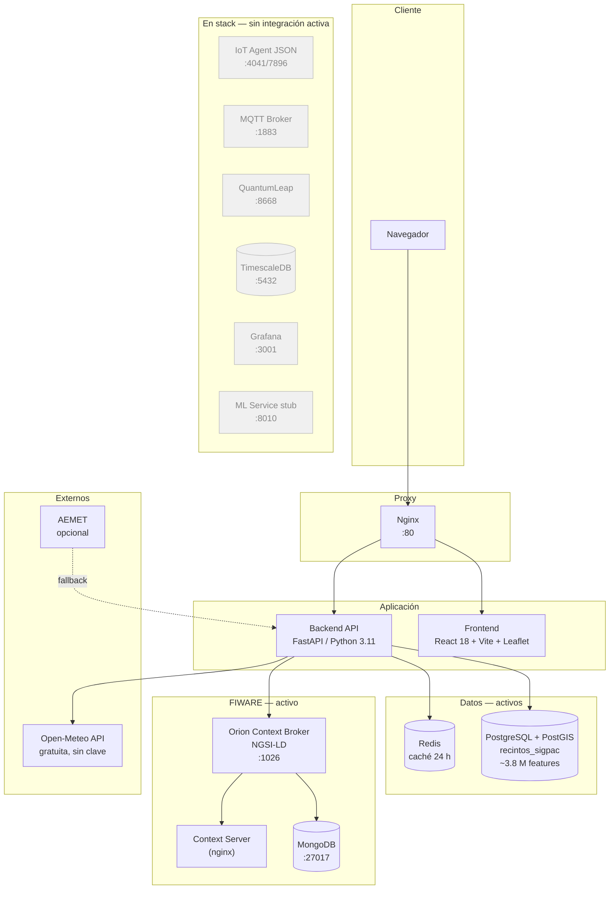

# TerraGalicia DSS — Arquitectura del sistema

**Última actualización**: mayo 2026

---

## 1. Visión general

TerraGalicia es una aplicación web de apoyo a la decisión agrícola cuya arquitectura combina una SPA React/Leaflet servida por Nginx, un backend FastAPI que centraliza la lógica de negocio y el acceso a datos, y una base de datos PostGIS con las parcelas del SIGPAC de A Coruña (~3.8 M features). El stack completo se orquesta con Docker Compose desde `infra/`.

El proyecto incluye también los servicios de la plataforma FIWARE (Orion Context Broker, IoT Agent, QuantumLeap) y componentes auxiliares (ML service, Grafana, TimescaleDB, MQTT broker). Todos están definidos en `docker-compose.yml` y arrancan con `docker-compose up -d`. Sin embargo, el flujo de datos activo de la aplicación hoy en día utiliza directamente PostGIS, Redis y Open-Meteo; los servicios FIWARE están activos como infraestructura preparada, pero la ingestión de sensores y la historización de series temporales no están operativas todavía.

---

## 2. Flujo principal de datos

```
Navegador
  └─► Nginx :80
        ├─► Frontend  (React 18 + Vite + Leaflet)   →  estático servido por Nginx
        └─► Backend   (FastAPI / Python 3.11)
               ├─► PostgreSQL + PostGIS  — recintos_sigpac (~3.8 M parcelas)
               ├─► Redis                — caché SIGPAC bbox (24 h TTL)
               ├─► Open-Meteo API       — previsión 7 días (gratuita, sin clave)
               └─► Orion Context Broker — entidades NGSI-LD (farms, parcelas, operaciones)
```

Orion está activo y el backend lo utiliza para almacenar entidades `AgriFarm`, `AgriParcel` y operaciones como NGSI-LD. El visor de parcelas SIGPAC y el ranking de cultivos funcionan sobre PostGIS + Redis, sin depender de Orion.

---

## 3. Inventario de servicios

| Servicio | Imagen / Build | Puerto(s) | Estado | Integración activa |
|---|---|---|---|---|
| `nginx` | `nginx:1.27-alpine` | 80 | Activo | Reverse proxy: `/` → frontend, `/api/` → backend |
| `frontend` | Build Vite/React | 3000 (interno) | Activo | SPA; Nginx la sirve en el puerto 80 |
| `backend` | Build FastAPI | 8000 | Activo | API REST; toda la lógica de negocio |
| `postgres` | `postgis/postgis:15-3.4` | 5433 | Activo | `recintos_sigpac` (3.8 M features) + datos de dominio |
| `redis` | `redis:7-alpine` | 6379 | Activo | Caché SIGPAC y suitability (TTL 24 h) |
| `orion` | `fiware/orion-ld:latest` | 1026 | Activo | Almacén NGSI-LD de entidades agronómicas |
| `mongo` | `mongo:5` | 27017 | Activo | Backend de persistencia de Orion |
| `context-server` | `nginx:1.27-alpine` | — (interno) | Activo | Sirve la definición `@context` NGSI-LD |
| `timescaledb` | `timescale/timescaledb:latest-pg15` | 5432 | Activo (sin datos) | Listo para QuantumLeap; sin series activas |
| `iot-agent` | `fiware/iotagent-json:latest` | 4041/7896 | Activo (sin ingestión) | En stack; sin sensores conectados |
| `mqtt-broker` | `eclipse-mosquitto:2` | 1883/9001 | Activo (sin clientes) | En stack; sin telemetría publicada |
| `quantumleap` | `orchestracities/quantumleap:latest` | 8668 | Activo (sin suscripciones) | En stack; sin historización activa |
| `grafana` | `grafana/grafana:latest` | 3001 | Activo (sin paneles) | UI accesible; sin dashboards configurados |
| `ml-service` | Build FastAPI stub | 8010 | Activo (stub) | Endpoint `/health`; scoring calculado inline en backend |

---

## 4. Diagrama de arquitectura



---

## 5. Pipeline de datos SIGPAC

El backend implementa una cadena de fallback para servir parcelas al frontend:

```
1. Redis cache (TTL 24 h, clave = bbox string exacto)
   └─ miss →
2. PostGIS query (recintos_sigpac, índice GiST)
   └─ fallo →
3. Ficheros .gpkg locales (Recintos_Coruña/, excluidos del repositorio)
   └─ fallo →
4. Mock data (5 parcelas sintéticas, solo desarrollo)
```

### Estrategia de geometría por zoom

| Zoom | Expresión SQL de geometría |
|---|---|
| ≤ 14 | `ST_AsGeoJSON(ST_Centroid(geom))` — punto (no llega el frontend) |
| 15 | `COALESCE(ST_AsGeoJSON(ST_Simplify(geom, 0.0002)), ST_AsGeoJSON(geom))` |
| 16 | `COALESCE(ST_AsGeoJSON(ST_Simplify(geom, 0.0001)), ST_AsGeoJSON(geom))` |
| ≥ 17 | `ST_AsGeoJSON(geom)` — geometría completa |

El `COALESCE` es necesario porque `ST_Simplify` puede devolver NULL en polígonos degenerados con tolerancia alta.

### Optimizaciones de rendimiento

- **Filtro espacial con índice GiST**: `geom && ST_MakeEnvelope(minx, miny, maxx, maxy, 4326)`.
- **Count-up-to-5001**: `SELECT count(*) FROM (SELECT 1 FROM recintos_sigpac WHERE geom && bbox LIMIT 5001) sub` — evita `COUNT(*)` completo (15–28 ms vs ~3,9 s).
- **Statement timeout**: `SET LOCAL statement_timeout = '15000'` dentro de una transacción explícita.
- **HARD_LIMIT = 5000**: máximo de parcelas devueltas por petición; `truncated = true` si `total_estimate > 5000`.
- **Redis cache**: TTL 24 h por clave `sigpac:bbox:{minx}:{miny}:{maxx}:{maxy}`.

El frontend impone zoom ≥ 15 para iniciar la carga; por debajo solo muestra el badge de aviso.

---

## 6. Arquitectura del frontend

SPA React 18 + Vite. El componente central es `MapView.jsx`. Componentes principales:

| Componente | Rol |
|---|---|
| `WMSLayers` | Capas base OSM y PNOA (IGN) vía WMS; control de capas Leaflet |
| `ParcelLayer` | Fetcher: llama `/api/v1/sigpac/parcels` en cada `moveend` y en cambio de `refreshTrigger` |
| `ParcelCanvasLayer` | Renderer imperativo: `L.canvas({ padding: 0.5 })` — un único `<canvas>` para todas las parcelas; `pointToLayer` → `L.circleMarker` para puntos centroides |
| `MapCenterUpdater` | Sincroniza el centro y zoom del mapa al estado React (usado por WeatherPanel) |
| `Legend` | Panel inferior-izquierdo colapsable: leyenda de colores de estado + coordenadas del cursor |
| `WeatherPanel` | Panel de tiempo: condiciones actuales + previsión 7 días (Open-Meteo) |
| `AgroCopilot` | Chat agrónomo: respuestas de fallback cuando LLM no está configurado |
| `WhatIfSimulator` | Simulador de escenarios de cultivo/fecha/riego |

El renderer canvas mantiene el rendimiento por debajo de 1 s para 5000 parcelas al evitar la creación de miles de nodos SVG en el DOM.

---

## 7. API REST (endpoints implementados)

| Endpoint | Método(s) | Descripción |
|---|---|---|
| `/api/v1/auth/login` | POST | JWT access token (form: `username`, `password`, `grant_type`) |
| `/api/v1/sigpac/parcels` | GET | Parcelas SIGPAC por bbox y zoom; parámetros: `bbox`, `zoom`, `limit` |
| `/api/v1/sigpac/nearby` | GET | Parcelas cerca de coordenadas; parámetros: `lat`, `lon`, `zoom`, `limit` |
| `/api/v1/parcels/{id}` | GET, PATCH | Detalle y actualización de estado de parcela |
| `/api/v1/parcels/{id}/suitability` | GET | Ranking de aptitud de cultivos (10 cultivos, scoring por reglas) |
| `/api/v1/parcels/{id}/operations` | GET, POST | Historial y registro de operaciones de parcela |
| `/api/v1/weather` | GET | Tiempo actual + previsión 7 días; parámetros: `lat`, `lon` |
| `/api/v1/copilot/chat` | POST | Chat AgroCopilot (respuestas de fallback si LLM no disponible) |
| `/api/v1/simulator/whatif` | POST | Simulación de escenarios de cultivo |

Los endpoints SIGPAC no requieren autenticación. El resto requiere `Authorization: Bearer <token>`.

---

## 8. Variables de entorno

Ver `infra/.env.example` para la lista completa. Las críticas para el arranque básico:

| Variable | Descripción |
|---|---|
| `DATABASE_URL_POSTGIS` | URL de conexión a PostGIS (asyncpg) |
| `REDIS_URL` | URL de conexión a Redis |
| `JWT_SECRET_KEY` | Clave de firma de access tokens |
| `JWT_REFRESH_SECRET_KEY` | Clave de firma de refresh tokens |
| `ORION_BASE_URL` | URL interna de Orion CB |
| `POSTGRES_USER`, `POSTGRES_PASSWORD`, `POSTGRES_DB` | Credenciales PostGIS |

Variables opcionales que habilitan funcionalidades adicionales: `AEMET_API_KEY`, `ML_SERVICE_URL`, `LLM_API_KEY`, `LLM_PROVIDER`.

---

## 9. Servicios FIWARE: papel previsto

El diseño del proyecto sigue el patrón de referencia FIWARE para agricultura inteligente:

- **Orion Context Broker**: estado actual de entidades NGSI-LD (`AgriFarm`, `AgriParcel`, operaciones). Activo y en uso.
- **IoT Agent JSON**: ingestión southbound de sensores de campo y APIs meteorológicas vía HTTP/MQTT. En stack; sin sensores conectados actualmente.
- **QuantumLeap**: historización de series temporales vía suscripciones Orion → TimescaleDB. En stack; sin suscripciones activas.
- **TimescaleDB**: almacén de series temporales para QuantumLeap. En stack; sin datos.
- **MQTT Broker (Mosquitto)**: broker de mensajería para telemetría de campo. En stack; sin clientes conectados.
- **ML Service**: servicio de clasificación de cultivos. Actualmente un stub; el scoring de aptitud se calcula inline en el backend.
- **Grafana**: dashboards operacionales sobre TimescaleDB y PostGIS. En stack; sin dashboards configurados.

La integración completa (sensores → IoT Agent → Orion → QuantumLeap → Grafana) forma parte del trabajo futuro.
