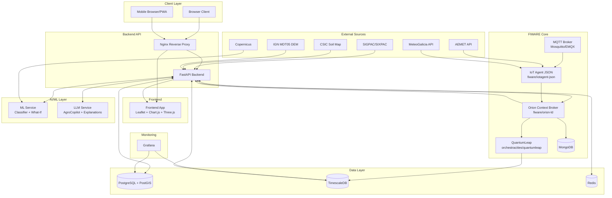

# TerraGalicia DSS Architecture (MVP)

**Last updated**: May 2026

## 1. Architecture Overview
TerraGalicia uses a hybrid **event-driven + REST** architecture aligned with FIWARE reference patterns: synchronous business operations are handled through a FastAPI backend (REST), while telemetry, weather ingestion, and historization rely on event propagation through IoT Agent, Orion Context Broker, and QuantumLeap. The architecture explicitly separates **current context state** (Orion CB, NGSI-LD), **static/geospatial domain data** (PostgreSQL + PostGIS), and **time-series history** (TimescaleDB via QuantumLeap). The AI/ML layer (crop suitability + explanation/chat) is decoupled from FIWARE core so model providers and inference stacks can evolve independently without changing context management contracts.

> **Implementation status (May 2026)**: The core SIGPAC viewer, parcel popup, weather panel, AgroCopilot, WhatIf simulator, and JWT authentication are implemented and running. IoT Agent, QuantumLeap, Grafana, and ML service are defined in Docker Compose but not yet started.

---

## 2. Component Inventory

| Component | Technology | Role | Port | Status |
|---|---|---|---|---|
| Frontend Web App | React 18 + Vite + Leaflet + Chart.js | Map UI (canvas-based SIGPAC viewer), parcel popups, weather panel, AgroCopilot chat, WhatIf simulator | 80 via Nginx | **Running** |
| Backend API | FastAPI (Python 3.11+) | REST API gateway, SIGPAC data service, auth, orchestration | 8000 | **Running** |
| Orion Context Broker | FIWARE Orion-LD (`fiware/orion-ld`) | NGSI-LD current state storage and query/subscription engine | 1026 | **Running** |
| MongoDB (Orion backend) | MongoDB 5 | Persistence backend for Orion current context entities | 27017 | **Running** |
| Context Server | Custom NGSI-LD context server | Serves `@context` definitions for NGSI-LD entities | — | **Running** |
| PostgreSQL + PostGIS | `postgis/postgis:15-3.4` | SIGPAC parcel geometry (`recintos_sigpac`), static domain data, ops audit projections | 5433 | **Running** |
| TimescaleDB | `timescale/timescaledb` (pg15) | Time-series storage for QuantumLeap (weather, sensor history) | 5432 | **Running** |
| Redis | `redis:7-alpine` | SIGPAC query cache (24h TTL), suitability scores, weather snapshots, session data | 6379 | **Running** |
| IoT Agent JSON | FIWARE IoT Agent JSON (`fiware/iotagent-json`) | Southbound ingestion (HTTP/MQTT), payload mapping to NGSI-LD updates | 4041/7896 | Defined — not started |
| QuantumLeap | `orchestracities/quantumleap` | Time-series historization via Orion subscription notifications | 8668 | Defined — not started |
| Grafana | `grafana/grafana:11` | Dashboards over TimescaleDB + PostgreSQL metrics and KPIs | 3001 | Defined — not started |
| ML Service | Custom FastAPI inference service | Crop classifier + What-If simulation engine | 8010 | Defined — not started |
| LLM Service | Ollama or OpenAI-compatible gateway | AgroCopilot conversational QA + explanation generation | 11434 | [DECISION NEEDED] Local Ollama vs managed endpoint — not started |
| Nginx Reverse Proxy | `nginx:1.27-alpine` | Routing, compression, security headers | 80 / 443 | **Running** |

Note: No MQTT broker is currently deployed. It will be added when the IoT Agent is activated [DECISION NEEDED: Mosquitto vs EMQX].

[EXTERNAL DEPENDENCY] Data providers: SIGPAC/SIXPAC, AEMET, MeteoGalicia, Copernicus, CSIC, IGN MDT05.

---

## 3. Deployment Architecture Diagram



---

## 4. FIWARE Integration Detail

### 4.1 Orion Context Broker
- **Entity scope (current state only)**:
  - `AgriFarm`, `AgriParcel`, `AgriCrop`, `AgriSoil`, `AgriParcelRecord`, `AgriParcelOperation`, `AgriFertilizer`, `WeatherObserved`, `WeatherForecast`, `WaterQualityObserved`.
- **Backend query mode (NGSI-LD vs NGSIv2)**:
  - Primary: NGSI-LD endpoints (`/ngsi-ld/v1/entities`, `/ngsi-ld/v1/subscriptions`, `/ngsi-ld/v1/temporal/entities` if enabled).
  - Compatibility: NGSIv2 endpoints only for legacy tools/connectors [DECISION NEEDED].
- **Subscription model**:
  - Orion subscriptions push change notifications to QuantumLeap notification endpoint.
  - Typical trigger attributes: telemetry/weather dynamic fields, operation events, parcel status/suitability updates.
  - Recommended `throttling`: 1-5 seconds to reduce write amplification under bursty sensor load.
- **Context URL configuration**:
  - Use `Link` header or payload `@context` with:
    - `https://uri.fiware.org/ns/data-models`
    - `https://schema.org`
  - Optionally include Smart Data Model contexts per entity family [DECISION NEEDED: centralized context registry service].

### 4.2 IoT Agent JSON
- **Provisioning model**:
  - One `service group` per domain stream, e.g. weather, parcel-sensors, water-quality.
  - Devices provisioned with explicit `entity_name`, `entity_type`, and attribute mapping.
- **Southbound transports**:
  - HTTP southbound: connectors/pollers posting normalized payloads.
  - MQTT southbound: field telemetry and event messages.
- **External mapping to entities**:
  - AEMET/MeteoGalicia -> `WeatherObserved`, `WeatherForecast`.
  - Field soil probes -> `AgriParcelRecord` (and optional aggregate update to `AgriParcel`).
  - Water probes/lab integration -> `WaterQualityObserved`.
  - Smart fertilizer tank/scale (if available) -> `AgriFertilizer.stockQuantity`.
- **Attribute mapping examples**:
  - `payload.temp_c` -> `WeatherObserved.temperature` (`unitCode=DEG_C`)
  - `payload.rh_pct` -> `WeatherObserved.relativeHumidity` (`unitCode=P1`)
  - `payload.rain_mm` -> `WeatherObserved.precipitation` (`unitCode=MM`)
  - `payload.soil_vwc` -> `AgriParcelRecord.soilMoistureVwc` (`unitCode=P1`)
  - `payload.water_ph` -> `WaterQualityObserved.ph` (`unitCode=pH`)
- **Example transformation (MeteoGalicia -> WeatherObserved)**:
  - Input sample:
    - `{ "stationId": "15030", "ts": "2026-04-21T10:00:00Z", "temp": 15.4, "hum": 83, "precip": 1.6, "wind": 3.8 }`
  - Normalized NGSI-LD update:
    - `id=urn:ngsi-ld:WeatherObserved:station:meteogalicia:15030:2026-04-21T10:00:00Z`
    - `temperature=15.4 (DEG_C)`
    - `relativeHumidity=0.83 (P1)`
    - `precipitation=1.6 (MM)`
    - `windSpeed=3.8 (MTS)`

### 4.3 QuantumLeap
- **Entities subscribed for historization (MVP)**:
  - High priority: `AgriParcelRecord`, `WeatherObserved`, `WeatherForecast`, `WaterQualityObserved`.
  - Also historize: dynamic attributes of `AgriParcel`, `AgriParcelOperation`, and `AgriFertilizer.stockQuantity`.
- **Query API used by Backend**:
  - STH-Comet compatible endpoints exposed by QuantumLeap (e.g., `/v2/entities/{entityId}/attrs/{attrName}` style access and aggregated queries).
  - Backend wraps these into stable domain endpoints for frontend consumption.
- **TimescaleDB integration**:
  - QuantumLeap writes temporal series into TimescaleDB hypertables.
  - Recommended continuous aggregates for daily parcel/weather summaries.
- **Retention policy**:
  - Minimum 2 years hot storage in TimescaleDB.
  - Recommended policy: keep raw 10-30 minute telemetry for 24 months, then downsample hourly/daily for long-term analytics [DECISION NEEDED].

---

## 5. Data Flow Descriptions

### Scenario A: Weather data ingestion (AEMET/MeteoGalicia -> Frontend)
1. Backend scheduler or weather connector fetches provider payloads from AEMET/MeteoGalicia [EXTERNAL DEPENDENCY].
2. Connector normalizes payload fields and posts to IoT Agent JSON over HTTP southbound.
3. IoT Agent maps fields to NGSI-LD attributes and updates `WeatherObserved`/`WeatherForecast` entities in Orion.
4. Orion sends subscribed change notifications to QuantumLeap.
5. QuantumLeap persists time-series points in TimescaleDB.
6. Backend API `GET /api/v1/weather` combines current values (Orion) with trends/aggregates (QuantumLeap/TimescaleDB), then caches response in Redis.
7. Frontend map and weather widgets request backend endpoint and render overlays, forecast cards, and chart series.

### Scenario B: Farmer logs a fertilizing operation (Frontend -> storage)
1. Farmer submits fertilizing form from parcel detail panel.
2. Frontend sends authenticated `POST /api/v1/parcels/{id}/operations` to FastAPI.
3. Backend validates RBAC, parcel ownership/permissions, and fertilizer reference.
4. Backend writes operation audit projection to PostgreSQL.
5. Backend creates/updates `AgriParcelOperation` entity in Orion (`operationType=fertilizing`, `refFertilizer`, `quantityApplied`).
6. Orion triggers QuantumLeap historization for operation event attributes.
7. If inventory tracking enabled, backend adjusts `AgriFertilizer.stockQuantity` in Orion and PostgreSQL projection.
8. Frontend refreshes operation timeline and parcel status summary.

### Scenario C: Crop suitability calculation (request -> color-coded map)
1. User clicks parcel and requests suitability details.
2. Frontend calls `GET /api/v1/parcels/{id}/suitability?crop=...`.
3. Backend reads cached score from Redis; on miss, it fetches parcel/soil/crop context from Orion and supporting static/geospatial data from PostgreSQL/PostGIS.
4. Backend retrieves recent weather/telemetry history from QuantumLeap/TimescaleDB.
5. Backend invokes ML Service to compute score bands and What-If projections.
6. Backend stores computed result in Redis with TTL aligned to weather/model update cadence.
7. Backend invokes LLM Service with parcel context + model factors for human-readable explanation.
8. Frontend renders color-coded suitability layer and explanation panel.

### Scenario D: AgroCopilot query (farmer question -> answer)
1. User sends chat prompt in AgroCopilot panel.
2. Frontend calls `POST /api/v1/copilot/chat` with conversation message and parcel context ID (if selected).
3. Backend authenticates user and retrieves contextual facts (parcel metadata, recent weather, suitability, recent operations) from Orion + cached aggregates.
4. Backend builds prompt template with guardrails (language, transparency, no unsafe agronomic claims) and sends to LLM Service.
5. LLM returns answer + structured rationale references.
6. Backend logs interaction metadata (without raw personal identifiers for analytics views) and returns response.
7. Frontend displays response, confidence hints, and suggested follow-up actions.

---

## 6. API Design Summary

| Endpoint | Methods | Description | Key parameters | Response format |
|---|---|---|---|---|
| `/api/v1/auth/login` | POST | Obtain JWT access token | `username`, `password`, `grant_type` (form) | JSON `{ access_token, token_type }` |
| `/api/v1/sigpac/parcels` | GET | SIGPAC parcels by viewport | `bbox` (minLon,minLat,maxLon,maxLat), `zoom`, `limit` (max 5000) | GeoJSON FeatureCollection + `truncated`, `total_estimate`, `returned` |
| `/api/v1/sigpac/nearby` | GET | SIGPAC parcels near cursor | `lat`, `lon`, `zoom`, `limit` | GeoJSON FeatureCollection |
| `/api/v1/farms` | GET, POST | List farms or create farm | `municipality`, `ownerId`, pagination | JSON list/item |
| `/api/v1/farms/{id}` | GET, PATCH | Retrieve/update farm metadata | `id` | JSON object |
| `/api/v1/parcels` | GET, POST | List parcels or create parcel | `farmId`, bbox, `status`, `crop` | GeoJSON FeatureCollection + metadata |
| `/api/v1/parcels/{id}` | GET, PATCH | Retrieve/update parcel details and status | `id` | JSON object with NGSI-LD-mapped fields |
| `/api/v1/parcels/{id}/suitability` | GET | Compute/fetch parcel suitability | `crop`, `scenario`, `irrigationMm`, `sowingDate` | JSON `{ score, band, factors, explanation, generatedAt }` |
| `/api/v1/parcels/{id}/operations` | GET, POST | List/create parcel operations | `id`, `from`, `to`, `operationType` | JSON list of operation records |
| `/api/v1/parcels/{id}/operations/{opId}` | PATCH | Update operation fields | `id`, `opId` | JSON updated record |
| `/api/v1/weather` | GET | Current + forecast weather | `lat`, `lon`, `days` | JSON `{ current, forecast, alerts, station }` |
| `/api/v1/weather/history` | GET | Historical weather series | `parcelId`, `from`, `to`, `step` | JSON time-series array |
| `/api/v1/crops` | GET, POST | Crop catalog list/create | `season`, `species` | JSON list/item |
| `/api/v1/crops/{id}` | GET, PATCH | Crop cycle detail/update | `id` | JSON object |
| `/api/v1/copilot/chat` | POST | AgroCopilot conversation endpoint | `message`, `parcelId`, `language`, `sessionId` | JSON `{ answer, references, followUps }` |
| `/api/v1/simulator/whatif` | POST | Multi-factor scenario simulation | `parcelId`, crop + scenario assumptions | JSON `{ baseline, scenarios, delta, recommendation }` |

Notes:
- Auth: `Authorization: Bearer <access_token>` for all non-public endpoints.
- Payload style: Backend REST responses are domain JSON; internally mapped to NGSI-LD entities and temporal series.
- SIGPAC endpoints (`/sigpac/parcels`, `/sigpac/nearby`) do not require authentication.

---

## 7. Security Architecture

### Authentication
- JWT-based auth with short-lived access tokens and refresh tokens.
- Refresh token rotation recommended; revoke-on-compromise support required [DECISION NEEDED: token denylist in Redis vs DB].

### Authorization (RBAC)

| Resource / Action | Farmer | Cooperative Manager | Extension Agent | Admin |
|---|---|---|---|---|
| View own farms/parcels | Allow | Allow | Allow (assigned scope) | Allow |
| View cooperative parcels | Own only | Allow (cooperative scope) | Allow (district scope, read-only) | Allow |
| Create/update operations | Allow (own scope) | Allow (cooperative scope) | Deny write [DECISION NEEDED] | Allow |
| Manage fertilizer inventory | Own/co-op scope | Allow | Read-only | Allow |
| Trigger bulletin/alerts | Deny | Allow (co-op) | Allow (district) | Allow |
| Use AgroCopilot | Allow | Allow | Allow | Allow |
| User/role administration | Deny | Deny | Deny | Allow |

### Network and transport security
- TLS termination at Nginx (`443`), HTTP redirected to HTTPS.
- Internal service-to-service traffic isolated in private Docker/Kubernetes network.
- CORS and strict security headers configured at Nginx and FastAPI.

### FIWARE access control
- MVP: Backend-only access to Orion/IoT Agent/QuantumLeap via internal network.
- Phase 2 optional: FIWARE PEP Proxy (Wilma) for policy enforcement in front of Orion and APIs.

### GDPR controls
- Data minimization for public endpoints (anonymized/aggregated parcel insights).
- Consent management for cooperative data sharing and comparative analytics [DECISION NEEDED: explicit per-feature consent UX].
- Audit trail for profile changes, operations edits, and data exports.
- Right-to-access/export/delete workflow through backend admin endpoints.

---

## 8. Infrastructure & Deployment

### 8.1 MVP deployment mode
- Recommended for MVP: Docker Compose on a single VM.
- Compose profile split suggested: `core`, `fiware`, `ai`, `monitoring` [DECISION NEEDED].

### 8.2 Services in docker-compose.yml

| Service name | Image | Status | Notes |
|---|---|---|---|
| `nginx` | `nginx:1.27-alpine` | **Running** | Reverse proxy: `/` → frontend, `/api/` → backend, `/grafana/` → grafana, `/orion/` → orion |
| `frontend` | Built from `frontend/Dockerfile` (Vite/React) | **Running** | Served by Nginx on port 80 |
| `backend` | Built from `backend/Dockerfile` (FastAPI) | **Running** | Port 8000 internally |
| `orion` | `fiware/orion-ld:latest` | **Running** | Port 1026; depends on `mongo` |
| `mongo` | `mongo:5` | **Running** | Orion persistence backend |
| `context-server` | Custom | **Running** | Serves NGSI-LD `@context` definitions |
| `postgres` | `postgis/postgis:15-3.4` | **Running** | Port 5433; hosts `recintos_sigpac` and domain tables |
| `timescaledb` | `timescale/timescaledb:latest-pg15` | **Running** | Port 5432; time-series storage (ready for QuantumLeap) |
| `redis` | `redis:7-alpine` | **Running** | Port 6379; SIGPAC cache (24h TTL), session data |
| `iot-agent` | `fiware/iotagent-json:latest` | Defined — not started | Needs MQTT broker; activate when sensors deployed |
| `quantumleap` | `orchestracities/quantumleap:latest` | Defined — not started | Needs Orion subscriptions configured |
| `grafana` | `grafana/grafana:11` | Defined — not started | Accessible at `/grafana/` when started |
| `ml-service` | Custom inference image | Defined — not started | Crop classifier + What-If engine |

### 8.3 Environment variables required (names only)
- `APP_ENV`
- `APP_BASE_URL`
- `JWT_SECRET_KEY`
- `JWT_REFRESH_SECRET_KEY`
- `JWT_ACCESS_TTL_MIN`
- `JWT_REFRESH_TTL_DAYS`
- `DATABASE_URL_POSTGIS`
- `DATABASE_URL_TIMESCALE`
- `REDIS_URL`
- `ORION_BASE_URL`
- `ORION_SERVICE`
- `ORION_SERVICEPATH`
- `NGSI_LD_CONTEXT_URLS`
- `IOTA_NORTH_URL`
- `IOTA_SOUTH_HTTP_PORT`
- `MQTT_BROKER_HOST`
- `MQTT_BROKER_PORT`
- `MQTT_USERNAME`
- `MQTT_PASSWORD`
- `QUANTUMLEAP_BASE_URL`
- `AEMET_API_KEY` [EXTERNAL DEPENDENCY]
- `METEOGALICIA_API_KEY` [EXTERNAL DEPENDENCY]
- `SIGPAC_SOURCE_URL` [EXTERNAL DEPENDENCY]
- `COPERNICUS_SOURCE_URL` [EXTERNAL DEPENDENCY]
- `CSIC_SOIL_SOURCE_URL` [EXTERNAL DEPENDENCY]
- `IGN_MDT05_SOURCE_URL` [EXTERNAL DEPENDENCY]
- `ML_SERVICE_URL`
- `ML_MODEL_VERSION`
- `LLM_PROVIDER`
- `LLM_API_BASE`
- `LLM_API_KEY` [EXTERNAL DEPENDENCY]
- `GRAFANA_ADMIN_USER`
- `GRAFANA_ADMIN_PASSWORD`
- `TLS_CERT_PATH`
- `TLS_KEY_PATH`

### 8.4 Production recommendation (MVP pilot)
- Minimum pilot topology: single cloud VM with Docker Compose and managed backups.
- Suggested minimum specs:
  - 8 vCPU
  - 32 GB RAM
  - 500 GB SSD
  - 1 Gbps network
- If local LLM inference is enabled on same node, upgrade to 64 GB RAM and optional GPU [DECISION NEEDED].
- [DECISION NEEDED] Cloud provider: AWS, Azure, OVHcloud, or on-prem cooperative hosting.

### 8.5 GitHub Actions CI/CD pipeline sketch
1. **CI lint/test**: run frontend and backend linting, unit tests, and schema checks.
2. **Build and scan**: build Docker images, run vulnerability scan (e.g., Trivy), publish to registry.
3. **Deploy to staging**: apply compose stack to staging VM, run smoke tests (health, auth, core APIs).
4. **Promote to production**: manual approval gate, deploy tagged release, run post-deploy checks and rollback hook.

---

## 9. ThreeJS 2.5D Terrain Panel
- **Purpose**: Visualize parcel terrain relief, sensor positions, and crop-health overlays in a dedicated 2.5D panel adjacent to the 2D Leaflet map.
- **Elevation source**: IGN MDT05 (5 m DEM for Spain) [EXTERNAL DEPENDENCY].
- **Integration model**:
  - Frontend panel implemented with Three.js scene/camera/controls.
  - Panel requests terrain/elevation tiles and parcel boundary geometry via Backend API.
  - Backend handles DEM fetch/cache/reprojection and returns mesh-ready elevation arrays.
- **MVP scope**:
  - Basic elevation mesh.
  - Parcel boundary overlay.
  - Sensor marker positions.
- **Phase 2 scope**:
  - Animated crop growth layers.
  - Real-time sensor pulsing/heat shaders.
  - Multi-parcel terrain comparison view [DECISION NEEDED].

---

---

## 10. SIGPAC Data Pipeline (Implemented)

### Data source and storage
SIGPAC parcel geometries for A Coruña province are stored in the `recintos_sigpac` PostGIS table (SRID 4326). A `.gpkg` file serves as a local fallback when PostGIS is unavailable or returns no data. A seed mock dataset provides a final fallback.

### Query strategy (zoom-based)
The backend selects geometry resolution based on the requested zoom level to balance detail against payload size:

| Zoom | SQL geometry expression | Frontend gate |
|---|---|---|
| < 14 | Backend returns empty (`zoom_too_low: true`) | Not reached (frontend gates at zoom < 15) |
| = 14 | `ST_AsGeoJSON(ST_Centroid(geom))` — Point | Not reached by frontend |
| = 15 | `COALESCE(ST_AsGeoJSON(ST_Simplify(geom, 0.0002)), ST_AsGeoJSON(geom))` | First zoom level that loads |
| = 16 | `COALESCE(ST_AsGeoJSON(ST_Simplify(geom, 0.0001)), ST_AsGeoJSON(geom))` | |
| ≥ 17 | `ST_AsGeoJSON(geom)` — full geometry | |

`COALESCE` is required because `ST_Simplify` can produce NULL for degenerate polygons at high tolerance.

### Performance optimizations
- **Spatial index filter**: `geom && ST_MakeEnvelope(minx, miny, maxx, maxy, 4326)` uses the GiST index for a fast bbox pre-filter.
- **Count-up-to-N+1**: `SELECT count(*) FROM (SELECT 1 FROM recintos_sigpac WHERE geom && bbox LIMIT 5001) sub` — avoids a full `COUNT(*)` scan; terminates at 5001 rows (~15–28 ms vs ~3.9 s).
- **Statement timeout**: `SET LOCAL statement_timeout = '15000'` inside an explicit transaction; prevents runaway queries.
- **HARD_LIMIT = 5000**: Maximum parcels returned per request. `truncated = (total_estimate > 5000)`.
- **Redis cache**: Results keyed by exact bbox string; TTL = 24 hours.

### Frontend rendering
The frontend uses a single imperative `ParcelCanvasLayer` component:
- **Renderer**: `L.canvas({ padding: 0.5 })` — all parcels share one `<canvas>` element; no per-feature SVG nodes.
- **`pointToLayer`**: Returns `L.circleMarker` for Point geometries (zoom-14 centroids) to avoid `L.Marker` DOM images.
- **Lifecycle**: `useEffect` with explicit `layer.remove()` on cleanup — prevents layer accumulation on pan/zoom.
- **Callback stability**: `callbackRef` pattern keeps `onEachFeature` current without recreating the canvas layer on every render.
- **Refresh**: `refreshTrigger` counter in `ParcelLayer`'s `useEffect` dependency array; incrementing it re-runs the effect (cancels in-flight, fetches new bbox, re-registers `moveend`).

---

## 11. Frontend Architecture (Implemented)

The frontend is a React 18 + Vite single-page application served by Nginx.

### Key components (MapView.jsx)

| Component | Role |
|---|---|
| `WMSLayers` | Adds OSM + PNOA WMS base layers and layer control to the Leaflet map |
| `ParcelLayer` | Data fetcher: calls `/api/v1/sigpac/parcels` on `moveend` and `refreshTrigger` changes; updates `parcelsGeoJson` state |
| `ParcelCanvasLayer` | Imperative canvas renderer for SIGPAC parcels; `L.canvas` renderer; `pointToLayer` → `L.circleMarker` |
| `MapCenterUpdater` | Tracks map center and zoom level into React state (used by weather panel) |
| `Legend` | Bottom-left collapsible legend; shows status colors + live mouse coordinates |
| `WeatherPanel` | Weather data drawer (bottom-right) |
| `AgroCopilot` | Conversational AI chat (bottom-right) |
| `WhatIfSimulator` | Modal scenario simulator (triggered from parcel popup) |

### SIGPAC UI controls (top-center, outside MapContainer)
```
.sigpac-controls (absolute, top-center)
  └─ .sigpac-controls-row
       ├─ .sigpac-toggle-btn  ("Amosar SIGPAC" / "Ocultar SIGPAC")
       └─ .sigpac-refresh-btn  (visible only when active; disabled while fetching)
  └─ .sigpac-truncated-banner  (visible only when truncated=true)
```

### Leaflet icon fix
```javascript
delete L.Icon.Default.prototype._getIconUrl;
L.Icon.Default.mergeOptions({ iconUrl, iconRetinaUrl, shadowUrl });
```
Applied at module level (before any component mounts) to resolve Vite asset-pipeline 404s for `marker-icon.png`.

---

## Implementation Notes and Open Decisions
- [DECISION NEEDED] MQTT broker selection (`eclipse-mosquitto` vs `emqx/emqx`).
- [DECISION NEEDED] Orion access pattern: NGSI-LD only vs dual NGSI-LD/NGSIv2 compatibility window.
- [DECISION NEEDED] Local LLM (Ollama) vs managed OpenAI-compatible provider.
- [DECISION NEEDED] Redis persistence mode (AOF, RDB, or no persistence for cache-only profile).
- [DECISION NEEDED] Consent UX depth for cooperative benchmarking data sharing.
- [EXTERNAL DEPENDENCY] Public API availability, rate limits, and licensing for SIGPAC, AEMET, MeteoGalicia, Copernicus, CSIC, IGN MDT05.
