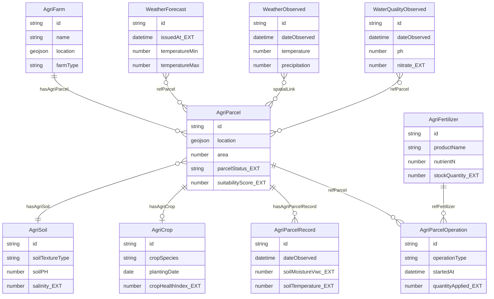
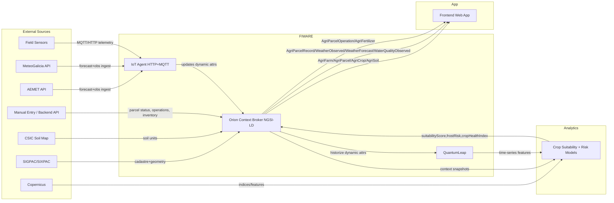

# TerraGalicia DSS NGSI-LD Data Model (MVP)

## 1. Overview
TerraGalicia uses **NGSI-LD** (instead of NGSIv2) to model agricultural data as linked entities with explicit semantics through `@context`, standard `Relationship` links, and interoperable geospatial properties. The model separates **static attributes** (rarely changed, mostly cadastral/agronomic metadata) from **dynamic attributes** (time-varying sensor, weather, and operational data). The **IoT Agent (HTTP + MQTT)** is responsible for ingesting field telemetry and selected weather feeds into dynamic attributes on operational entities. **QuantumLeap** historizes entities with time-series value (notably telemetry, weather, parcel state, operations, and forecast snapshots) for analytics, trend views, and ML feature generation.

---

## 2. Entity Definitions

### AgriFarm
- **NGSI-LD type**: `AgriFarm`
- **@context**: `https://raw.githubusercontent.com/smart-data-models/dataModel.Agrifood/master/context.jsonld`
- **Example id pattern**: `urn:ngsi-ld:AgriFarm:farm001`

| Attribute | NGSI-LD type | Value type | Static/Dynamic | Source | Description |
|---|---|---|---|---|---|
| id | Property | URN string | Static | manual entry | Unique farm identifier |
| type | Property | string | Static | system | Must be `AgriFarm` |
| name | Property | string | Static | manual entry | Farm display name |
| farmType | Property | string | Static | manual entry | Smallholder, cooperative, mixed |
| ownerName | Property | string | Static | manual entry | Farm owner/manager |
| location | GeoProperty | GeoJSON Point/Polygon | Static | SIGPAC / manual entry | Farm centroid or boundary |
| address | Property | object/string | Static | manual entry | Administrative address |
| refMunicipality | Relationship | URN (`AdministrativeArea`) | Static | manual entry | Municipality link (A Coruña area) |
| hasAgriParcel | Relationship | URN list (`AgriParcel`) | Dynamic | API | Parcels belonging to this farm |
| cooperativeCode [EXTENSION] | Property | string | Static | manual entry | Cooperative membership identifier |

- **Relationships to other entities**:
  - `AgriFarm (1) -> (N) AgriParcel` via `hasAgriParcel`
- **IoT Agent note**: No direct writes. Farm is managed by backend/API.
- **QuantumLeap note**: Optional historization of `hasAgriParcel` (portfolio evolution) if needed for auditing.

### AgriParcel
- **NGSI-LD type**: `AgriParcel`
- **@context**: `https://raw.githubusercontent.com/smart-data-models/dataModel.Agrifood/master/context.jsonld`
- **Example id pattern**: `urn:ngsi-ld:AgriParcel:farm001:parcel01`

| Attribute | NGSI-LD type | Value type | Static/Dynamic | Source | Description |
|---|---|---|---|---|---|
| id | Property | URN string | Static | system | Unique parcel identifier |
| type | Property | string | Static | system | Must be `AgriParcel` |
| location | GeoProperty | GeoJSON Polygon | Static | SIGPAC | Parcel boundary |
| area | Property | number | Static | SIGPAC | Parcel area in ha (`HAR`) |
| category | Property | string | Static | SIGPAC | Land-use/crop category |
| cadastralReference [EXTENSION] | Property | string | Static | SIGPAC | Cadastre/SIXPAC identifier |
| belongsTo | Relationship | URN (`AgriFarm`) | Static | API | Parent farm |
| hasAgriSoil | Relationship | URN (`AgriSoil`) | Static | CSIC / API | Dominant soil profile link |
| hasAgriCrop | Relationship | URN (`AgriCrop`) | Dynamic | API | Current crop assignment |
| hasAgriParcelRecord | Relationship | URN list (`AgriParcelRecord`) | Dynamic | IoT sensor/API | Recent telemetry records |
| parcelStatus [EXTENSION] | Property | string enum | Dynamic | manual entry / API | Allowed values: `PLANTED`, `FALLOW`, `PREPARED`, `HARVESTED` |
| suitabilityScore [EXTENSION] | Property | number | Dynamic | ML model | Crop suitability score (0-1) |
| lastIrrigationDate [EXTENSION] | Property | date-time | Dynamic | IoT sensor/manual entry | Last irrigation timestamp |
| soilMoistureAvg24h [EXTENSION] | Property | number | Dynamic | IoT sensor | 24h average soil moisture (`P1` fraction or `%`) |

- **Relationships to other entities**:
  - `AgriParcel (N) -> (1) AgriFarm` via `belongsTo`
  - `AgriParcel (N) -> (1) AgriSoil` via `hasAgriSoil`
  - `AgriParcel (N) -> (0..1) AgriCrop` via `hasAgriCrop`
  - `AgriParcel (1) -> (N) AgriParcelRecord` via `hasAgriParcelRecord`
  - `AgriParcel (1) -> (N) AgriParcelOperation` via inverse `refParcel`
- **IoT Agent note**: Writes derived telemetry aggregates (`soilMoistureAvg24h`, optional `lastIrrigationDate`) via MQTT bridge every 15 minutes.
- **QuantumLeap note**: Historize `parcelStatus`, `suitabilityScore`, `soilMoistureAvg24h`, `lastIrrigationDate`.

### AgriCrop
- **NGSI-LD type**: `AgriCrop`
- **@context**: `https://raw.githubusercontent.com/smart-data-models/dataModel.Agrifood/master/context.jsonld`
- **Example id pattern**: `urn:ngsi-ld:AgriCrop:parcel01:maize:2026S1`

| Attribute | NGSI-LD type | Value type | Static/Dynamic | Source | Description |
|---|---|---|---|---|---|
| id | Property | URN string | Static | system | Unique crop-cycle identifier |
| type | Property | string | Static | system | Must be `AgriCrop` |
| cropSpecies | Property | string | Static | manual entry | Species (e.g., maize, potato) |
| variety [EXTENSION] | Property | string | Static | manual entry | Cultivar/variety |
| plantingDate | Property | date | Dynamic | manual entry / API | Actual planting date |
| expectedHarvestDate | Property | date | Dynamic | ML model/manual entry | Forecast/plan harvest date |
| phenologyStage [EXTENSION] | Property | string | Dynamic | IoT sensor / extension agent | Current stage (emergence, vegetative, etc.) |
| cropHealthIndex [EXTENSION] | Property | number | Dynamic | ML model / Copernicus | Health index (0-1) |
| refParcel | Relationship | URN (`AgriParcel`) | Static | API | Parcel where crop is cultivated |

- **Relationships to other entities**:
  - `AgriCrop (N) -> (1) AgriParcel` via `refParcel`
- **IoT Agent note**: Usually indirect; optional updates to `phenologyStage` from device/topic enrichers weekly/daily.
- **QuantumLeap note**: Historize `phenologyStage`, `cropHealthIndex`, and plan date revisions.

### AgriSoil
- **NGSI-LD type**: `AgriSoil`
- **@context**: `https://raw.githubusercontent.com/smart-data-models/dataModel.Agrifood/master/context.jsonld`
- **Example id pattern**: `urn:ngsi-ld:AgriSoil:soilunit:ES15030:001`

| Attribute | NGSI-LD type | Value type | Static/Dynamic | Source | Description |
|---|---|---|---|---|---|
| id | Property | URN string | Static | system | Soil unit identifier |
| type | Property | string | Static | system | Must be `AgriSoil` |
| soilTextureType | Property | string | Static | CSIC Soil Map | Texture class |
| soilPH | Property | number | Static | CSIC / lab | Typical pH (`pH`) |
| organicMatter [EXTENSION] | Property | number | Static | CSIC / lab | Organic matter percentage (`%`) |
| cationExchangeCapacity [EXTENSION] | Property | number | Static | CSIC / lab | CEC (`cmol(+)/kg`) |
| drainageClass [EXTENSION] | Property | string | Static | CSIC | Drainage category |
| salinity [EXTENSION] | Property | number | Dynamic | IoT sensor / lab | Electrical conductivity (`dS/m`) |
| soilMoistureBaseline [EXTENSION] | Property | number | Dynamic | IoT sensor / model | Baseline moisture (`%`) |
| location | GeoProperty | GeoJSON Polygon | Static | CSIC | Spatial extent of soil unit |

- **Relationships to other entities**:
  - `AgriSoil (1) -> (N) AgriParcel` via inverse of `hasAgriSoil`
- **IoT Agent note**: Optional writes to `salinity` and `soilMoistureBaseline` via HTTP every 1-6 hours.
- **QuantumLeap note**: Historize `salinity`, `soilMoistureBaseline` when sensors are installed.

### AgriParcelRecord
- **NGSI-LD type**: `AgriParcelRecord`
- **@context**: `https://raw.githubusercontent.com/smart-data-models/dataModel.Agrifood/master/context.jsonld`
- **Example id pattern**: `urn:ngsi-ld:AgriParcelRecord:parcel01:2026-04-21T10:00:00Z`

| Attribute | NGSI-LD type | Value type | Static/Dynamic | Source | Description |
|---|---|---|---|---|---|
| id | Property | URN string | Static | system | Record identifier (time-scoped) |
| type | Property | string | Static | system | Must be `AgriParcelRecord` |
| refParcel | Relationship | URN (`AgriParcel`) | Static | API | Parcel measured |
| source | Property | string | Static | IoT sensor | Sensor/station origin |
| dateObserved | Property | date-time | Dynamic | IoT sensor | Observation timestamp |
| soilMoistureVwc [EXTENSION] | Property | number | Dynamic | IoT sensor | Volumetric soil water content (`P1` or `%`) |
| soilTemperature [EXTENSION] | Property | number | Dynamic | IoT sensor | Soil temperature (`DEG_C`) |
| airTemperature [EXTENSION] | Property | number | Dynamic | IoT sensor | Near-surface temperature (`DEG_C`) |
| batteryLevel [EXTENSION] | Property | number | Dynamic | IoT sensor | Device battery (`%`) |
| signalStrength [EXTENSION] | Property | number | Dynamic | IoT sensor | Radio signal (`dBm`) |

- **Relationships to other entities**:
  - `AgriParcelRecord (N) -> (1) AgriParcel` via `refParcel`
- **IoT Agent note**: Primary write target. MQTT topics from field probes, with HTTP fallback. Typical frequency: every 10-30 minutes.
- **QuantumLeap note**: Historize all dynamic measurement fields and `dateObserved`.

### AgriParcelOperation
- **NGSI-LD type**: `AgriParcelOperation`
- **@context**: `https://raw.githubusercontent.com/smart-data-models/dataModel.Agrifood/master/context.jsonld`
- **Example id pattern**: `urn:ngsi-ld:AgriParcelOperation:parcel01:fertilizing:2026-04-21`

| Attribute | NGSI-LD type | Value type | Static/Dynamic | Source | Description |
|---|---|---|---|---|---|
| id | Property | URN string | Static | system | Operation event identifier |
| type | Property | string | Static | system | Must be `AgriParcelOperation` |
| operationType | Property | string | Static | manual entry / API | e.g., sowing, fertilizing, irrigation |
| plannedStartAt [EXTENSION] | Property | date-time | Dynamic | manual entry | Planned start |
| startedAt | Property | date-time | Dynamic | manual entry / API | Actual start |
| endedAt | Property | date-time | Dynamic | manual entry / API | Actual end |
| operatorName [EXTENSION] | Property | string | Static | manual entry | Person/team performing operation |
| quantityApplied [EXTENSION] | Property | number | Dynamic | manual entry / IoT | Applied input amount (`kg`/`L`) |
| unitCode [EXTENSION] | Property | string | Dynamic | manual entry / IoT | UCUM/QUDT code for quantity |
| notes [EXTENSION] | Property | string | Dynamic | manual entry | Free operation notes |
| refParcel | Relationship | URN (`AgriParcel`) | Static | API | Target parcel |
| refFertilizer | Relationship | URN (`AgriFertilizer`) | Dynamic | API | Fertilizer used when `operationType=fertilizing` |

- **Relationships to other entities**:
  - `AgriParcelOperation (N) -> (1) AgriParcel` via `refParcel`
  - `AgriParcelOperation (N) -> (0..1) AgriFertilizer` via `refFertilizer`
- **IoT Agent note**: Optional write path from smart spreaders/tanks via MQTT (event-based).
- **QuantumLeap note**: Historize `operationType`, timing fields, `quantityApplied`, `refFertilizer` to represent fertilization history (no separate entity).

### AgriFertilizer
- **NGSI-LD type**: `AgriFertilizer`
- **@context**: `https://raw.githubusercontent.com/smart-data-models/dataModel.Agrifood/master/context.jsonld`
- **Example id pattern**: `urn:ngsi-ld:AgriFertilizer:npk-15-15-15:batch2026-03`

| Attribute | NGSI-LD type | Value type | Static/Dynamic | Source | Description |
|---|---|---|---|---|---|
| id | Property | URN string | Static | system | Fertilizer product/batch identifier |
| type | Property | string | Static | system | Must be `AgriFertilizer` |
| productName | Property | string | Static | manual entry | Commercial name |
| nutrientN | Property | number | Static | manual entry | Nitrogen percentage (`%`) |
| nutrientP | Property | number | Static | manual entry | Phosphorus percentage (`%`) |
| nutrientK | Property | number | Static | manual entry | Potassium percentage (`%`) |
| formulationType [EXTENSION] | Property | string | Static | manual entry | Granular/liquid/foliar |
| stockQuantity [EXTENSION] | Property | number | Dynamic | manual entry / IoT | Current stock (`kg`/`L`) |
| unitCode [EXTENSION] | Property | string | Static | manual entry | Stock unit UCUM/QUDT |
| expiryDate [EXTENSION] | Property | date | Static | manual entry | Product expiry |
| supplierName [EXTENSION] | Property | string | Static | manual entry | Supplier reference |

- **Relationships to other entities**:
  - `AgriFertilizer (1) -> (N) AgriParcelOperation` via inverse of `refFertilizer`
- **IoT Agent note**: Optional stock updates from smart tanks/scales via HTTP every 1 hour.
- **QuantumLeap note**: Historize `stockQuantity` and low-stock threshold events.

### WeatherObserved
- **NGSI-LD type**: `WeatherObserved`
- **@context**: `https://raw.githubusercontent.com/smart-data-models/dataModel.Weather/master/context.jsonld`
- **Example id pattern**: `urn:ngsi-ld:WeatherObserved:station:meteogalicia:15030:2026-04-21T10:00:00Z`

| Attribute | NGSI-LD type | Value type | Static/Dynamic | Source | Description |
|---|---|---|---|---|---|
| id | Property | URN string | Static | system | Observation identifier |
| type | Property | string | Static | system | Must be `WeatherObserved` |
| dateObserved | Property | date-time | Dynamic | MeteoGalicia / AEMET | Observation time |
| location | GeoProperty | GeoJSON Point | Static | MeteoGalicia / AEMET | Station coordinates |
| temperature | Property | number | Dynamic | MeteoGalicia / AEMET | Air temperature (`DEG_C`) |
| relativeHumidity | Property | number | Dynamic | MeteoGalicia / AEMET | Relative humidity (`P1` or `%`) |
| precipitation | Property | number | Dynamic | MeteoGalicia / AEMET | Precipitation (`MM`) |
| windSpeed | Property | number | Dynamic | MeteoGalicia / AEMET | Wind speed (`MTS`) |
| solarRadiation [EXTENSION] | Property | number | Dynamic | MeteoGalicia | Global radiation (`W/m2`) |
| refPointOfInterest [EXTENSION] | Relationship | URN (`AgriFarm`/`AgriParcel`) | Dynamic | API | Optional nearest farm/parcel link |

- **Relationships to other entities**:
  - `WeatherObserved (N) -> (0..N) AgriParcel` via spatial association or `refPointOfInterest`
- **IoT Agent note**: Ingests from HTTP weather connectors at 10-60 minute intervals.
- **QuantumLeap note**: Full historization of weather variables for analytics, forecasting features, and alerting.

### WeatherForecast
- **NGSI-LD type**: `WeatherForecast`
- **@context**: `https://raw.githubusercontent.com/smart-data-models/dataModel.Weather/master/context.jsonld`
- **Example id pattern**: `urn:ngsi-ld:WeatherForecast:grid:15030:2026-04-22T00:00:00Z`

| Attribute | NGSI-LD type | Value type | Static/Dynamic | Source | Description |
|---|---|---|---|---|---|
| id | Property | URN string | Static | system | Forecast identifier |
| type | Property | string | Static | system | Must be `WeatherForecast` |
| issuedAt [EXTENSION] | Property | date-time | Dynamic | AEMET / MeteoGalicia | Forecast publication time |
| validFrom [EXTENSION] | Property | date-time | Dynamic | AEMET / MeteoGalicia | Forecast start |
| validTo [EXTENSION] | Property | date-time | Dynamic | AEMET / MeteoGalicia | Forecast end |
| location | GeoProperty | GeoJSON Point/Polygon | Static | AEMET / MeteoGalicia | Forecast cell/point |
| temperatureMin | Property | number | Dynamic | AEMET / MeteoGalicia | Min temperature (`DEG_C`) |
| temperatureMax | Property | number | Dynamic | AEMET / MeteoGalicia | Max temperature (`DEG_C`) |
| precipitationProbability [EXTENSION] | Property | number | Dynamic | AEMET / MeteoGalicia | Probability (`P1` or `%`) |
| frostRisk [EXTENSION] | Property | number | Dynamic | ML model | Frost risk score (0-1) |
| refParcel [EXTENSION] | Relationship | URN list (`AgriParcel`) | Dynamic | API | Parcels covered by forecast cell |

- **Relationships to other entities**:
  - `WeatherForecast (1) -> (N) AgriParcel` via `refParcel`
- **IoT Agent note**: Updated by scheduled weather ingestor over HTTP every 6 hours (or provider cadence).
- **QuantumLeap note**: Historize forecast snapshots (`issuedAt`, min/max temp, precipitation probability, frost risk).

### WaterQualityObserved
- **NGSI-LD type**: `WaterQualityObserved`
- **@context**: `https://raw.githubusercontent.com/smart-data-models/dataModel.WaterQuality/master/context.jsonld`
- **Example id pattern**: `urn:ngsi-ld:WaterQualityObserved:source:well12:2026-04-21T10:00:00Z`

| Attribute | NGSI-LD type | Value type | Static/Dynamic | Source | Description |
|---|---|---|---|---|---|
| id | Property | URN string | Static | system | Water quality sample identifier |
| type | Property | string | Static | system | Must be `WaterQualityObserved` |
| dateObserved | Property | date-time | Dynamic | IoT sensor / lab | Observation timestamp |
| location | GeoProperty | GeoJSON Point | Static | IoT sensor / manual entry | Well/river source location |
| ph | Property | number | Dynamic | IoT sensor / lab | Acidity/alkalinity (`pH`) |
| electricalConductivity [EXTENSION] | Property | number | Dynamic | IoT sensor / lab | EC (`uS/cm`) |
| nitrate [EXTENSION] | Property | number | Dynamic | IoT sensor / lab | Nitrate concentration (`mg/L`) |
| dissolvedOxygen [EXTENSION] | Property | number | Dynamic | IoT sensor / lab | Dissolved oxygen (`mg/L`) |
| turbidity [EXTENSION] | Property | number | Dynamic | IoT sensor / lab | Turbidity (`NTU`) |
| refParcel [EXTENSION] | Relationship | URN list (`AgriParcel`) | Dynamic | API | Parcels irrigated by this source |

- **Relationships to other entities**:
  - `WaterQualityObserved (N) -> (0..N) AgriParcel` via `refParcel`
- **IoT Agent note**: MQTT ingestion from water probes every 30-60 minutes; manual lab upload via HTTP.
- **QuantumLeap note**: Historize all measured quality indicators and compliance thresholds.

---

## 3. Entity Relationship Diagram



---

## 4. Static vs Dynamic Summary Table

| Entity | STATIC attributes | DYNAMIC attributes |
|---|---|---|
| AgriFarm | id, type, name, farmType, ownerName, location, address, refMunicipality, cooperativeCode [EXTENSION] | hasAgriParcel |
| AgriParcel | id, type, location, area, category, cadastralReference [EXTENSION], belongsTo, hasAgriSoil | hasAgriCrop, hasAgriParcelRecord, parcelStatus [EXTENSION], suitabilityScore [EXTENSION], lastIrrigationDate [EXTENSION], soilMoistureAvg24h [EXTENSION] |
| AgriCrop | id, type, cropSpecies, variety [EXTENSION], refParcel | plantingDate, expectedHarvestDate, phenologyStage [EXTENSION], cropHealthIndex [EXTENSION] |
| AgriSoil | id, type, soilTextureType, soilPH, organicMatter [EXTENSION], cationExchangeCapacity [EXTENSION], drainageClass [EXTENSION], location | salinity [EXTENSION], soilMoistureBaseline [EXTENSION] |
| AgriParcelRecord | id, type, refParcel, source | dateObserved, soilMoistureVwc [EXTENSION], soilTemperature [EXTENSION], airTemperature [EXTENSION], batteryLevel [EXTENSION], signalStrength [EXTENSION] |
| AgriParcelOperation | id, type, operationType, operatorName [EXTENSION], refParcel | plannedStartAt [EXTENSION], startedAt, endedAt, quantityApplied [EXTENSION], unitCode [EXTENSION], notes [EXTENSION], refFertilizer |
| AgriFertilizer | id, type, productName, nutrientN, nutrientP, nutrientK, formulationType [EXTENSION], unitCode [EXTENSION], expiryDate [EXTENSION], supplierName [EXTENSION] | stockQuantity [EXTENSION] |
| WeatherObserved | id, type, location | dateObserved, temperature, relativeHumidity, precipitation, windSpeed, solarRadiation [EXTENSION], refPointOfInterest [EXTENSION] |
| WeatherForecast | id, type, location | issuedAt [EXTENSION], validFrom [EXTENSION], validTo [EXTENSION], temperatureMin, temperatureMax, precipitationProbability [EXTENSION], frostRisk [EXTENSION], refParcel [EXTENSION] |
| WaterQualityObserved | id, type, location | dateObserved, ph, electricalConductivity [EXTENSION], nitrate [EXTENSION], dissolvedOxygen [EXTENSION], turbidity [EXTENSION], refParcel [EXTENSION] |

---

## 5. IoT Data Flow Diagram



**Entities typically updated by IoT Agent**:
- `AgriParcelRecord`
- `WeatherObserved`
- `WeatherForecast` (through weather connector jobs)
- `WaterQualityObserved`
- Optional dynamic updates to `AgriParcel`, `AgriSoil`, `AgriFertilizer`, and telemetry-assisted `AgriParcelOperation`

**Entities historized by QuantumLeap (MVP priority)**:
- `AgriParcelRecord`, `WeatherObserved`, `WeatherForecast`, `WaterQualityObserved`
- `AgriParcel` dynamic fields (`parcelStatus`, `suitabilityScore`, moisture aggregates)
- `AgriParcelOperation` event/timing/quantity fields
- `AgriFertilizer.stockQuantity`

**Entities feeding ML model**:
- `AgriParcel`, `AgriSoil`, `AgriCrop`, `AgriParcelRecord`, `WeatherObserved`, `WeatherForecast`, `WaterQualityObserved`, `AgriParcelOperation`

---

## 6. NGSI-LD Example Payloads

> Base context required by TerraGalicia MVP:
> - `https://uri.fiware.org/ns/data-models`
> - `https://schema.org`

### 6.1 AgriParcel example

```json
{
  "id": "urn:ngsi-ld:AgriParcel:farm001:parcel01",
  "type": "AgriParcel",
  "name": {
    "type": "Property",
    "value": "North Terrace Parcel"
  },
  "location": {
    "type": "GeoProperty",
    "value": {
      "type": "Polygon",
      "coordinates": [
        [
          [-8.3962, 43.3644],
          [-8.3956, 43.3644],
          [-8.3955, 43.3640],
          [-8.3961, 43.3640],
          [-8.3962, 43.3644]
        ]
      ]
    }
  },
  "area": {
    "type": "Property",
    "value": 1.42,
    "unitCode": "HAR"
  },
  "category": {
    "type": "Property",
    "value": "arable"
  },
  "parcelStatus": {
    "type": "Property",
    "value": "PLANTED"
  },
  "belongsTo": {
    "type": "Relationship",
    "object": "urn:ngsi-ld:AgriFarm:farm001"
  },
  "hasAgriSoil": {
    "type": "Relationship",
    "object": "urn:ngsi-ld:AgriSoil:soilunit:ES15030:001"
  },
  "@context": [
    "https://uri.fiware.org/ns/data-models",
    "https://schema.org"
  ]
}
```

### 6.2 AgriParcelRecord example

```json
{
  "id": "urn:ngsi-ld:AgriParcelRecord:parcel01:2026-04-21T10:00:00Z",
  "type": "AgriParcelRecord",
  "refParcel": {
    "type": "Relationship",
    "object": "urn:ngsi-ld:AgriParcel:farm001:parcel01"
  },
  "source": {
    "type": "Property",
    "value": "iot:soil-probe:node-17"
  },
  "dateObserved": {
    "type": "Property",
    "value": "2026-04-21T10:00:00Z"
  },
  "soilMoistureVwc": {
    "type": "Property",
    "value": 0.29,
    "unitCode": "P1"
  },
  "soilTemperature": {
    "type": "Property",
    "value": 14.8,
    "unitCode": "DEG_C"
  },
  "airTemperature": {
    "type": "Property",
    "value": 16.1,
    "unitCode": "DEG_C"
  },
  "batteryLevel": {
    "type": "Property",
    "value": 82,
    "unitCode": "P1"
  },
  "@context": [
    "https://uri.fiware.org/ns/data-models",
    "https://schema.org"
  ]
}
```

### 6.3 WeatherObserved example

```json
{
  "id": "urn:ngsi-ld:WeatherObserved:station:meteogalicia:15030:2026-04-21T10:00:00Z",
  "type": "WeatherObserved",
  "dateObserved": {
    "type": "Property",
    "value": "2026-04-21T10:00:00Z"
  },
  "location": {
    "type": "GeoProperty",
    "value": {
      "type": "Point",
      "coordinates": [-8.4115, 43.3623]
    }
  },
  "temperature": {
    "type": "Property",
    "value": 15.4,
    "unitCode": "DEG_C"
  },
  "relativeHumidity": {
    "type": "Property",
    "value": 0.83,
    "unitCode": "P1"
  },
  "precipitation": {
    "type": "Property",
    "value": 1.6,
    "unitCode": "MM"
  },
  "windSpeed": {
    "type": "Property",
    "value": 3.8,
    "unitCode": "MTS"
  },
  "source": {
    "type": "Property",
    "value": "MeteoGalicia"
  },
  "@context": [
    "https://uri.fiware.org/ns/data-models",
    "https://schema.org"
  ]
}
```

### 6.4 AgriParcelOperation example (fertilizing)

```json
{
  "id": "urn:ngsi-ld:AgriParcelOperation:parcel01:fertilizing:2026-04-21",
  "type": "AgriParcelOperation",
  "operationType": {
    "type": "Property",
    "value": "fertilizing"
  },
  "startedAt": {
    "type": "Property",
    "value": "2026-04-21T08:30:00Z"
  },
  "endedAt": {
    "type": "Property",
    "value": "2026-04-21T09:05:00Z"
  },
  "quantityApplied": {
    "type": "Property",
    "value": 120,
    "unitCode": "KGM"
  },
  "unitCode": {
    "type": "Property",
    "value": "KGM"
  },
  "notes": {
    "type": "Property",
    "value": "NPK basal application before rain window"
  },
  "refParcel": {
    "type": "Relationship",
    "object": "urn:ngsi-ld:AgriParcel:farm001:parcel01"
  },
  "refFertilizer": {
    "type": "Relationship",
    "object": "urn:ngsi-ld:AgriFertilizer:npk-15-15-15:batch2026-03"
  },
  "@context": [
    "https://uri.fiware.org/ns/data-models",
    "https://schema.org"
  ]
}
```

---

## 7. Cross-sector Entities Note

Beyond AgriFood models, TerraGalicia should include the following transversal Smart Data Models:

- **Device**: To represent physical probes, gateways, and weather stations (manufacturer, firmware, battery, connectivity, calibration metadata).
- **Alert**: For frost risk, pest outbreaks, irrigation stress, and fertilizer stock warnings, consumable by AgroCopilot and notification channels.
- **Sensor / SensorObservation (where adopted by deployment profile)**: Useful when device metadata and raw sensor streams must be managed separately from agronomic entities.
- **Building / PointOfInterest / AdministrativeArea**: Useful for farm facilities, cooperative hubs, and municipality-level aggregation/reporting.
- **DataService / Dataset (catalog-level metadata)**: Recommended for governance, interoperability, and external sharing (e.g., NGSI-LD exports for public initiatives).

These cross-sector entities improve interoperability with smart rural, water, and climate ecosystems while preserving TerraGalicia’s AgriFood core.
